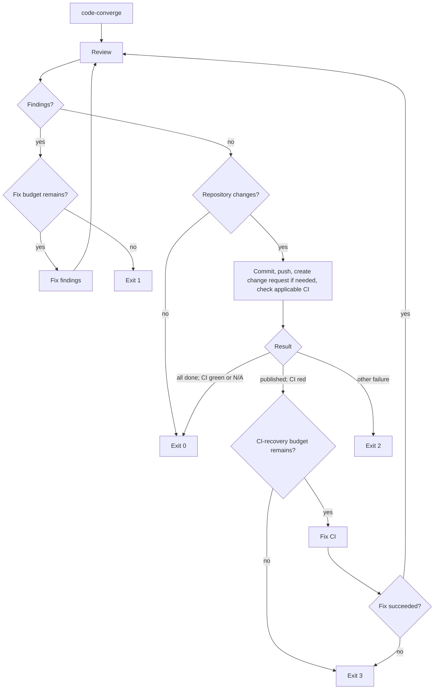

# code-converge

`code-converge` (also known as `review-fixes` and `improver`) is a Go CLI that closes the agent-development loop: it asks an agent to review the current repository, fixes the findings, commits and publishes the result, and makes sure required CI is green when CI applies.

`code-converge` supports [Codex](https://github.com/openai/codex) as its only agent. The command is intended to be run from the repository that should be reviewed.

## Root help

`code-converge -h` and `code-converge --help` are equivalent, write the following usage line to stdout, and exit `0` without loading configuration or starting an update or review workflow:

```text
usage: code-converge [flags] [config]
```

## Workflow



### Implementation flow

```text
┌─────────────────────────────────────────────────────────────────────┐
│                        code-converge CLI                                  │
└─────────────────────────────────────────────────────────────────────┘

  args ──► parse flags ──► load config ──┬── config cmd? ──► print & exit 0
                                        │
                                        ▼
                              ┌──────────────────┐
                              │   run_started     │
                              └────────┬─────────┘
                                       │
                 ┌─────────────────────┘
                 │  phase=1, cycle=1, fixes=0, recoveries=0
                 │
                 ▼
        ╔═══════════════════╗     ◄──────────────────────────────┐
        ║   REVIEW STAGE    ║                                   │
        ║                   ║                                   │
        ║ codex exec        ║                                   │
        ║ schema + snapshot ║                                   │
        ╚════════╤══════════╝                                   │
                 │                                              │
                 ▼                                              │
        ┌────────────────┐                                      │
        │ Read strict JSON│                                      │
        │ final file only │                                      │
        └───────┬────────┘                                      │
                │                                               │
       ┌────────┴────────┐                                      │
       │                 │                                      │
       ▼                 ▼                                      │
  ┌─────────┐     ┌───────────┐                                 │
  │  CLEAN  │     │  FINDINGS │                                 │
  │         │     │           │                                 │
  │  counts │     │  counts   │                                 │
  │  = 0    │     │  P0..P3   │                                 │
  └────┬────┘     └─────┬─────┘                                 │
       │                │                                       │
       │           fixes < max_cycles?                          │
       │           ┌────┴────┐                                  │
       │          yes        no ──► exit 1 (findings_remaining) │
       │           │                                              │
       │           ▼                                              │
       │  ╔══════════════════════╗                               │
       │  ║   FIX-FINDINGS      ║                               │
       │  ║                     ║                               │
       │  ║ codex exec -        ║                               │
       │  ║ stdin:              ║                               │
       │  ║  fix_prompt +       ║                               │
       │  ║  "\n\n" +           ║                               │
       │  ║  review_report      ║                               │
       │  ╚═════════╤═══════════╝                               │
       │            │                                           │
       │         fixes++                                        │
       │         cycle++                                        │
       │            │                                           │
       │            └───────────────────────────────────────────┘
       │
       ▼
  ┌──────────────────────┐
  │ Check Git status     │
  │ staged / unstaged /  │
  │ untracked changes?   │
  └───────┬─────────┬────┘
          │ yes     │ no
          ▼         └────────► run_completed success, exit 0
  ╔══════════════════════╗
  ║   FINALIZE STAGE     ║
  ║                      ║
  ║ codex exec -         ║
  ║   --output-schema    ║
  ║   --output-last-msg  ║
  ║ stdin: finalize      ║
  ║   prompt             ║
  ╚════════╤═════════════╝
           │
           ▼
  ┌────────────────────┐
  │  Parse JSON verdict│
  │                    │
  │  {verdict, commit, │
  │   push, cr, ci}    │
  └─────────┬──────────┘
            │
     ┌──────┼──────────┐
     │      │          │
     ▼      ▼          ▼
 SUCCESS  CI_FAILED  FAILED
     │      │          │
     │      │          └──► exit 2 (operational_failure)
     │      │
     │  recoveries < max?
     │  ┌────┴────┐
     │ yes        no ──► exit 3 (ci_failure)
     │  │
     │  ▼
     │ ╔══════════════╗
     │ ║  FIX-CI      ║
     │ ║              ║
     │ ║ codex exec - ║
     │ ║ stdin: ci    ║
     │ ║   fix prompt ║
     │ ╚══════╤═══════╝
     │        │
     │   recoveries++
     │   phase++
     │   cycle=1, fixes=0
     │        │
     │        └──────► back to REVIEW
     │
     ▼
  ╔═══════════════╗
  ║ run_completed ║
  ║ status=success║
  ║ exit_code=0   ║
  ╚═══════════════╝
```

Key points:

- **Review** — resolves the intended pull-request base and runs one schema-constrained `codex exec` against a private merge-base-to-worktree snapshot, including committed, staged, unstaged and untracked changes. Only the final-message file is classified; terminal stdout/stderr are not review data.
- **Fix** — `codex exec -`, stdin = fix-prompt + full review report. The stateless remediation session receives the findings it must address.
- **Finalize** — `codex exec --output-schema`, strict JSON verdict with hard validation.
- **CI recovery** — on `CI_FAILED`, fixes CI, resets the fix cycle, and restarts from Review.
- **Budget** — `max-cycles` counts only fix attempts, not the initial review.
- **Fail closed** — unknown output ≠ clean; mixed output = error.

### 1. Review

`code-converge` runs non-interactive `codex exec --output-schema <schema> --output-last-message <message> -` in the current directory. By default it resolves one review base in this order: an explicit review-base setting, the base of one open pull request for the current branch, `branch.<current>.gh-merge-base`, then exactly one remote default-branch ref. Provider discovery resolves its branch name against one remote-tracking ref and compares its commit SHA with the provider's advertised base SHA; a stale ref fails with an actionable fetch diagnostic. The resolved base SHA is pinned for every review in the run. Code-Converge computes the merge-base and prepares a private Git index from that tree plus the current worktree; this includes committed, staged, unstaged and untracked changes without modifying the real index or worktree. The exact private `GIT_INDEX_FILE` is supplied to the Codex process and forced into its spawned-tool environment for that invocation; the review instruction compares `git diff --cached` from the computed merge base. Ambiguous, missing or stale candidates fail with a diagnostic before Codex starts. Provider discovery through `gh` is optional; unavailable `gh` or authentication falls through to local Git sources. No implicit fetch, PR mutation or other remote mutation occurs.

`--review-base <ref>`, `CODE_CONVERGE_REVIEW_BASE` and `.code-converge/review-base` explicitly select the base using the normal configuration precedence. A branch already merged into the selected base has no committed delta but still reviews worktree changes; a fully clean run follows the existing clean/no-change path. It uses the model and reasoning effort resolved from the selected mode and any explicit stage overrides.

The review adapter supplies a strict JSON Schema and, after a zero Codex exit, reads only the file named by `--output-last-message`. The response must contain exactly `findings`, `overall_correctness`, `overall_explanation`, and `overall_confidence_score`; every finding must contain `title`, `body`, `confidence_score`, numeric `priority`, and `code_location` in the documented nested shape. An empty `findings` array is the only clean result. Plain text, terminal stdout/stderr, duplicate or unknown fields, invalid priorities, missing/empty/malformed files, and non-zero command exits cannot be classified as clean and produce operational exit `2`. Codex compatibility is capability-based: the configured CLI must support `exec`, `--output-schema`, and `--output-last-message`; unsupported invocations fail closed without falling back to terminal parsing.

For metrics, schema priorities are normalized as follows: `0` (`P0`) → `critical`, `1` (`P1`) → `high`, `2` (`P2`) → `medium`, and `3` (`P3`) → `low`. Any other priority makes the response invalid. The public `unknown` counter remains present for event-schema compatibility and is zero for accepted structured responses. `findings_total` must equal the sum of all five counters.

### 2. Fix findings

When the review has findings, `code-converge` starts a fresh Codex session with the configured fix-findings prompt followed by the complete classified review report. This gives the stateless remediation session the findings it must address without forwarding the report to workflow stdout. By default, the prompt is:

```text
fix findings
```

The default `fast` profile uses `gpt-5.6-luna` with reasoning effort `medium`. After a successful agent run, the workflow returns to **Review**.

`max-cycles` is the maximum number of fix-findings attempts in one review phase; its built-in default is `10` and it must be non-negative. The initial review does not consume this budget. After the final allowed fix attempt, `code-converge` always performs one verification review. If that review still has findings, `code-converge` reports that the limit has been reached and exits with code `1`. A failed fix-findings command is an operational failure and exits with code `2`.

### 3. Commit, push, create a change request, and check CI

Once a review returns no findings, `code-converge` checks Git status for staged, unstaged and untracked changes. If there are none, it completes successfully as a no-op without starting finalization or attempting an empty commit. If changes exist, it asks Codex to finalize them. The default prompt is:

```text
commit, push, create PR, ensure CI is green
```

The default `fast` profile uses `gpt-5.6-luna` with reasoning effort `medium` for this stage. The final agent response must report exactly one of these states:

| State | Meaning | Next action |
| --- | --- | --- |
| `SUCCESS` | Changes are committed and pushed; a change request was created when needed; required CI is green or CI is not applicable. | Exit `0`. |
| `CI_FAILED` | Publication succeeded, but applicable required CI is red. | Run **Fix CI**. |
| `FAILED` | Any other failure (for example, unable to commit, push, or create a PR). | Exit `2`. |

In addition to the single verdict, the final response reports the outcome of `commit`, `push`, `change_request`, and `ci` so `code-converge` can emit the required step records. Missing or internally inconsistent details cannot be interpreted as success and cause an operational failure (`2`).

### 4. Fix CI

When finalization reports `CI_FAILED`, `code-converge` starts Codex with the configured CI-fix prompt. This stage is skipped when the target repository has no applicable required CI. Its built-in prompt is:

```text
Исправь CI
```

The default `fast` profile uses `gpt-5.6-luna` with reasoning effort `medium` for this stage.

If the agent completes successfully, the entire workflow begins again with a new **Review** phase and a fresh `max-cycles` budget, rather than only re-checking CI. The run also has a separate non-negative `max-ci-recoveries` budget, default `3`, to prevent an endless clean-review/failing-CI loop. If the CI-fix command fails, or CI is still red after all recovery attempts have been used, `code-converge` exits with code `3`.

## Exit codes

| Code | Meaning |
| --- | --- |
| `0` | The review is clean and either no staged, unstaged or untracked changes exist, or changes are committed and pushed; a change request exists if needed; required CI is green or CI is not applicable. `update` also returns `0` when the installed version is current or the user declines the update. |
| `1` | Review findings remain after the configured maximum number of fix-findings attempts. |
| `2` | An operational/configuration failure occurred, review output was ambiguous, fix-findings failed, or finalization failed for a reason other than red CI. `update` uses it for unsupported hosts, invalid release metadata, download/checksum failures, or replacement/permission failures. |
| `3` | The CI-fix stage failed or the maximum number of CI-recovery attempts was exhausted. |

## Logging and metrics

During a workflow run, `code-converge` writes operational progress to standard output in one deterministically selected format: `human` or `kv`. The built-in default is `human`; select `kv` explicitly for machine-readable automation. TTY detection never selects the semantic format. Raw Codex stdout and stderr are captured by the process boundary and are never review-result data or workflow stdout; stderr may enrich the diagnostic for a failed Codex process. Unless disabled, private diagnostic session records capture those invocation details locally; they are not event-stream records.

### Structured `kv` format

`kv` preserves the stable machine-readable stream. Every stage transition and meaningful step is exactly one newline-terminated record.

Every record starts with `ts` and `event`. Stage-scoped records also include `stage`; review-loop records include `review_phase` and `cycle`. Completion records include their result and elapsed stage time as defined below.

Records use stable `key=value` fields separated by one ASCII space. Field names contain only lowercase ASCII letters, digits, and underscores. Values must not contain whitespace, `=`, or newlines; free-form text is written to stderr instead. `ts` is UTC RFC 3339, durations are integer milliseconds, and unknown/optional fields are omitted only when the event contract says they are inapplicable.

`review_phase` starts at `1` and increments after every successful CI-fix stage. `cycle` starts at `1` in each review phase. A fix-findings stage uses the same cycle number as the review that produced its input; the next review increments `cycle`. Therefore, with `max-cycles=10`, the last allowed fix uses `cycle=10` and its mandatory verification review uses `cycle=11`. A new review phase resets `cycle` to `1`.

The required event catalog is:

| Event | Required event-specific fields |
| --- | --- |
| `run_started` | No fields beyond `ts` and `event`. |
| `stage_started` | `stage`, `model`, `reasoning_effort`; also `review_phase` and `cycle` for `review` and `fix-findings`, and `review_phase` for `fix-ci`. |
| `review_completed` | `stage=review`, `model`, `reasoning_effort`, `review_phase`, `cycle`, `status=clean\|findings\|failed`, and `duration_ms`. A classified result (`clean` or `findings`) also requires all findings counters plus `review_scope=branch_and_worktree`, `review_base` (resolved commit SHA), `review_merge_base` and `review_base_source=explicit\|open_pr\|branch_merge_base\|remote_default`; on command or classification failure these fields and counters are omitted. This is the review stage's sole completion record. |
| `stage_completed` | `stage=fix-findings\|finalize\|fix-ci`, `model`, `reasoning_effort`, `status=success\|failed`, and `duration_ms`; `fix-findings` also has `review_phase` and `cycle`, while `fix-ci` has `review_phase`. A successfully parsed finalization response also requires `verdict=SUCCESS\|CI_FAILED\|FAILED`; an invocation or parsing failure uses `status=failed` and omits `verdict`. |
| `step_completed` | `stage=finalize`, `model`, `reasoning_effort`, `step=commit\|push\|change_request\|ci`, and `status=success\|skipped\|failed\|unknown`. Each finalization attempt emits one record for every listed step; a step that is inapplicable or not reached is `skipped`, while an outcome that cannot be established is `unknown`. |
| `run_completed` | `status=success\|findings_remaining\|operational_failure\|ci_failure`, `exit_code`, and `total_duration_ms`. |

For example:

```text
ts=2026-07-21T10:04:05Z event=stage_started stage=review model=gpt-5.6-sol reasoning_effort=medium review_phase=1 cycle=2
ts=2026-07-21T10:06:18Z event=review_completed stage=review model=gpt-5.6-sol reasoning_effort=medium review_phase=1 cycle=2 status=findings findings_total=3 findings_critical=0 findings_high=1 findings_medium=2 findings_low=0 findings_unknown=0 duration_ms=133000
ts=2026-07-21T10:06:19Z event=stage_started stage=fix-findings model=gpt-5.6-luna reasoning_effort=medium review_phase=1 cycle=2
ts=2026-07-21T10:10:42Z event=stage_completed stage=fix-findings model=gpt-5.6-luna reasoning_effort=medium review_phase=1 cycle=2 status=success duration_ms=263000
ts=2026-07-21T10:12:00Z event=step_completed stage=finalize model=gpt-5.3-codex-spark reasoning_effort=agent-default step=change_request status=skipped
```

### Review metrics

Every successfully classified review logs `findings_total` plus `findings_critical`, `findings_high`, `findings_medium`, `findings_low`, and `findings_unknown`. Every counter is present even when its value is `0`. If the review command fails or its report is ambiguous, `status=failed` is emitted with `duration_ms`; finding counters are omitted because no reliable review result exists.

The review-completion record is emitted even when there are no findings, for example:

```text
ts=2026-07-21T10:12:09Z event=review_completed stage=review model=gpt-5.6-sol reasoning_effort=medium review_phase=1 cycle=3 status=clean findings_total=0 findings_critical=0 findings_high=0 findings_medium=0 findings_low=0 findings_unknown=0 duration_ms=87000
```

This makes the trend across cycles directly measurable without requiring it to be monotonic: the `findings_*` fields show how the number and severity change, while `duration_ms` measures the cost of each review, fix, finalization, and CI-fix stage. `run_completed` contains `status`, `exit_code`, and `total_duration_ms`.

### Human format

Human is the built-in format for concise operator output. Every permanent line starts with local `HH:MM:SS`; retryable stage lines then include `[attempt/max] [model/reasoning-effort]` with no separator before the message. The overall terminal line has no attempt or model because it does not belong to a single stage. Human lines omit raw event keys, zero-valued severity buckets, and the redundant `run_started` record. Durations below one minute use seconds rounded to a tenth with a trailing `.0` removed; longer durations use rounded whole seconds in compact `h m s` form. Select `--log-format=kv` when an integration requires the machine-readable event stream.

When diagnostic session logging is enabled and its record directory has been created, human output first writes exactly one permanent path handoff such as `22:14:05 Session log: /Users/me/.code-converge/session-logs/session-...`. It contains no session content. `kv` output and `--no-session-log` omit this line.

| Workflow result | Human output |
| --- | --- |
| Review starts in the initial phase (non-TTY) | `22:14:05 [1/10] [gpt-5.6-sol/high] Review started` |
| Review starts after the first CI recovery (non-TTY) | `22:14:05 [1/10] [gpt-5.6-sol/high] Review started (phase 2 after CI recovery 1)` |
| Review is clean | `22:14:05 [2/10] [gpt-5.6-sol/high] Review: clean (1m 27s)` |
| Review has findings | `22:14:05 [2/10] [gpt-5.6-sol/high] Review: 3 findings — 1 high, 2 medium (2m 13s)` |
| Review fails | `22:14:05 [2/10] [gpt-5.6-sol/high] Review failed (2m 13s)` |
| Fix findings starts / succeeds / fails | `22:14:05 [2/10] [gpt-5.6-luna/medium] Fixing findings` / `22:14:05 [2/10] [gpt-5.6-luna/medium] Findings fixed (4m 23s)` / `22:14:05 [2/10] [gpt-5.6-luna/medium] Fixing findings failed (4m 23s)` |
| Finalization starts | `22:14:05 [gpt-5.3-codex-spark/agent-default] Finalizing` |
| Finalization step | `22:14:05 [gpt-5.3-codex-spark/agent-default]   Commit: done` (and equivalent step status) |
| Finalization succeeds | `22:14:05 [gpt-5.3-codex-spark/agent-default] Finalized successfully (42s)` |
| Finalization reports red CI | `22:14:05 [gpt-5.3-codex-spark/agent-default] Finalized, but CI is failing (42s)` |
| Finalization fails | `22:14:05 [gpt-5.3-codex-spark/agent-default] Finalization failed (42s)` |
| CI recovery starts / succeeds / fails | `22:14:05 [1/3] [agent-default/agent-default] CI recovery` / `22:14:05 [1/3] [agent-default/agent-default] CI recovery fixed (1m 8s)` / `22:14:05 [1/3] [agent-default/agent-default] CI recovery failed (1m 8s)` |
| Run succeeds | `22:14:05 Done (8m 45s)` |
| Findings remain | `22:14:05 Stopped: review findings remain (8m 45s, exit 1)` |
| Operational failure | `22:14:05 Failed due to an operational error (8m 45s, exit 2)` |
| CI remains red | `22:14:05 Stopped: CI is still failing (8m 45s, exit 3)` |

A findings summary always includes the total and only its non-zero severity counts, ordered critical, high, medium, low, unknown. Successful terminal lines omit exit `0`; failure terminal lines retain exit codes `1`, `2`, and `3`.

### Liveness

In human mode on an interactive stdout terminal, each Codex-backed stage displays one in-place elapsed-time line such as `22:14:05 [1/10] [gpt-5.6-sol/high] Reviewing... 1m 24s`. The timer changes once per second while a soft color highlight travels across the fully colored line and returns at a 10-frame-per-second refresh rate. The live line replaces the permanent stage-start line in an interactive terminal, so the output is not duplicated. The line is cleared before permanent stdout or diagnostic stderr output.

`--color=never` or the presence of `NO_COLOR` disables shimmer while retaining the elapsed line. `auto` uses true color when advertised by `COLORTERM`, ANSI-256 when advertised by `TERM`, basic magenta/cyan otherwise, and no color for unknown or dumb terminals.

Non-TTY output has no implicit liveness and never contains ANSI controls. In human mode, an explicit positive heartbeat replaces transient animation and emits newline-safe records at the requested interval:

```text
22:14:05 [1/10] [gpt-5.6-sol/high] Review still running (30s)
22:15:05 [1/10] [gpt-5.6-sol/high] Review still running (1m)
```

Heartbeat is disabled by default, accepts `0` or a Go duration of at least `1s`, and is rejected with `log-format=kv`. Liveness stops and joins before stage completion, failure, cancellation, or later output; a liveness write error becomes operational failure.

`code-converge config` is a separate human-readable command and is not part of the workflow event stream.

## Configuration

Every option can be supplied in four places: a command-line flag, an environment variable, project configuration, or user configuration.

Resolution order is highest to lowest priority:

1. Command-line flags
2. Project configuration in `<git-root>/.code-converge/`
3. User configuration in `~/.code-converge/`
4. Environment variables
5. Built-in defaults

`mode` resolves through this order and defaults to `fast`. Each explicit per-stage model or reasoning-effort setting from any of the first four sources overrides the selected profile; source precedence is then applied among those explicit settings. An unset stage setting inherits from the effective mode.

This matches the configuration approach of [`start-issue`](https://github.com/dapi/start-issue): a project may pin shared behavior, a user may set personal defaults, and a one-off invocation can override either.

Prompts are file-backed, so they can be reviewed and versioned with project configuration. An absent project/user prompt file means that source has no value and resolution continues. An explicitly supplied CLI or environment path that does not exist is a configuration error and exits `2`. Relative CLI/environment paths are resolved from the current directory; project and user prompt files are resolved inside their respective configuration directories.

### Model profiles

The `fast` and `best` modes select these operative stage profiles. `fast` is the built-in mode. Code-Converge passes both resolved values to Codex as `-c model=<model>` and `-c model_reasoning_effort=<effort>` for every stage.

| Stage | Fast | Best | Escalate to `gpt-5.6-sol` when |
| --- | --- | --- | --- |
| Review | `gpt-5.6-terra`, `medium` | `gpt-5.6-sol`, `high` | Not applicable: independent quality judgment is the stage's primary purpose. |
| Fix findings | `gpt-5.6-luna`, `medium` | `gpt-5.6-terra`, `high` | Findings involve architecture, security, migrations, concurrency, or several connected modules. |
| Finalize | `gpt-5.6-luna`, `medium` | `gpt-5.6-luna`, `medium` | Finalization requires diagnosing an unusual Git, change-request, or CI workflow; otherwise route CI failures to Fix CI. |
| Fix CI | `gpt-5.6-luna`, `medium` | `gpt-5.6-terra`, `high` | The cause is not localized by logs, spans multiple components, or persists after a repair. |

### Options and defaults

| Option | Flag | Environment variable | Project / user file | Default |
| --- | --- | --- | --- | --- |
| Workflow log format | `--log-format` | `CODE_CONVERGE_LOG_FORMAT` | `log-format` | `human` |
| Human liveness heartbeat | `--heartbeat` | `CODE_CONVERGE_HEARTBEAT` | `heartbeat` | `0` (disabled) |
| Interactive shimmer color | `--color` | `CODE_CONVERGE_COLOR` | `color` | `auto` |
| Mode | `--mode` | `CODE_CONVERGE_MODE` | `mode` | `fast` |
| Maximum fix-findings attempts per review phase | `--max-cycles` | `CODE_CONVERGE_MAX_CYCLES` | `max-cycles` | `10` |
| Maximum CI recoveries | `--max-ci-recoveries` | `CODE_CONVERGE_MAX_CI_RECOVERIES` | `max-ci-recoveries` | `3` |
| Review model | `--review-model` | `CODE_CONVERGE_REVIEW_MODEL` | `review-model` | selected profile |
| Review reasoning effort | `--review-reasoning-effort` | `CODE_CONVERGE_REVIEW_REASONING_EFFORT` | `review-reasoning-effort` | selected profile |
| Fix-findings model | `--fix-model` | `CODE_CONVERGE_FIX_MODEL` | `fix-model` | selected profile |
| Fix-findings reasoning effort | `--fix-reasoning-effort` | `CODE_CONVERGE_FIX_REASONING_EFFORT` | `fix-reasoning-effort` | selected profile |
| Fix-findings prompt | `--fix-prompt-file` | `CODE_CONVERGE_FIX_PROMPT_FILE` | `fix-findings.md` | `fix findings` |
| Finalization model | `--finalize-model` | `CODE_CONVERGE_FINALIZE_MODEL` | `finalize-model` | selected profile |
| Finalization reasoning effort | `--finalize-reasoning-effort` | `CODE_CONVERGE_FINALIZE_REASONING_EFFORT` | `finalize-reasoning-effort` | selected profile |
| Finalization prompt | `--finalize-prompt-file` | `CODE_CONVERGE_FINALIZE_PROMPT_FILE` | `finalize.md` | `commit, push, create PR, ensure CI is green` |
| CI-fix model | `--ci-fix-model` | `CODE_CONVERGE_CI_FIX_MODEL` | `ci-fix-model` | selected profile |
| CI-fix reasoning effort | `--ci-fix-reasoning-effort` | `CODE_CONVERGE_CI_FIX_REASONING_EFFORT` | `ci-fix-reasoning-effort` | selected profile |
| CI-fix prompt | `--ci-fix-prompt-file` | `CODE_CONVERGE_CI_FIX_PROMPT_FILE` | `fix-ci.md` | `Исправь CI` |
| Review base override | `--review-base` | `CODE_CONVERGE_REVIEW_BASE` | `review-base` | discover intended base |
| Diagnostic session-log directory | `--session-log-dir` | `CODE_CONVERGE_SESSION_LOG_DIR` | `session-log-dir` | `~/.code-converge/session-logs` |
| Diagnostic session-log retention | `--session-log-retention` | `CODE_CONVERGE_SESSION_LOG_RETENTION` | `session-log-retention` | `24h` |
| Disable diagnostic logging for this run | `--no-session-log` | — | — | disabled only when flag supplied |

For example, a team can commit these files:

```text
.code-converge/
├── log-format
├── heartbeat
├── color
├── mode
├── review-model
├── review-reasoning-effort
├── review-base
├── fix-model
├── fix-reasoning-effort
├── finalize-model
├── finalize-reasoning-effort
├── ci-fix-model
├── ci-fix-reasoning-effort
├── max-cycles
├── max-ci-recoveries
├── session-log-dir
├── session-log-retention
├── fix-findings.md
├── finalize.md
└── fix-ci.md
```

The same layout in `~/.code-converge/` sets user-level defaults. Environment variables are particularly useful in CI or temporary shell sessions:

```sh
CODE_CONVERGE_MAX_CYCLES=3 \
CODE_CONVERGE_REVIEW_MODEL=gpt-5.6-sol \
code-converge
```

`session-log-dir` must resolve to an absolute path (a leading `~` expands to the user home); `session-log-retention` is a Go duration of at least `1s`. `0` and negative values are invalid; use `--no-session-log` for a no-artifact run. At the start of an enabled run, Code-Converge creates an owner-only directory where the platform permits, then best-effort removes only expired direct `session-*` child directories from that configured root. Cleanup, create, write and permission failures are diagnostics on stderr and do not alter an otherwise valid workflow result. Session records include redacted command/stdin/stdout/stderr data, but may still contain sensitive repository content, prompts, paths and agent output. They never include process environment values; known credential-bearing argument/text forms are replaced with `[REDACTED]`. Use `--no-session-log` when such local retention is not acceptable.

### Show effective settings

Use the dedicated configuration command to inspect the active configuration:

```sh
code-converge config
```

It prints the effective mode and every setting with its effective value and source. Profile-derived settings identify the selected profile; explicit settings identify their winning source. Whenever an effective value differs from the global `fast` built-in baseline, that baseline is shown too. This makes overrides and configuration precedence explicit without starting a review.

Example shape of the output:

```text
mode: fast (built-in default)
review-model: gpt-5.6-terra (fast profile)
max-cycles: 3 (project; built-in: 10)
fix-prompt: .code-converge/fix-findings.md (project; built-in: "fix findings")
```

## Requirements

- Go runtime is not required to run a released binary; it is required to build from source.
- `codex` must be installed, authenticated, and available on `PATH` when running `code-converge`.
- The authenticated account must have access to every model selected by the effective profile and any explicit stage overrides.
- The target directory must be a Git repository.
- `git` and any tooling or credentials required by the target repository's chosen remote-hosting workflow must be available to the finalization agent. No hosting provider is required by `code-converge`; provider-specific tooling is needed only when the selected finalization actions depend on it.

## Build and install

The supported first-release targets are macOS and Linux on AMD64 and ARM64. Released archives contain a single statically built `code-converge` binary and are accompanied by `SHA256SUMS`; a Go runtime is not required after installation.

Check the installed binary version with:

```sh
code-converge --version
```

It prints `code-converge vX.Y.Z` for a release binary.

### Update an installed binary

On macOS or Linux AMD64/ARM64, an installed release binary can safely update itself from the latest stable [GitHub Release](https://github.com/dapi/code-converge/releases):

```sh
code-converge update
```

The command compares the running semantic version with the latest release. When a newer compatible release exists, it prints the target version and release notes (or the release URL), then prompts `Install update? [y/N]: `. Only the exact replies `y` and `yes` proceed; all other input leaves the current executable unchanged. An already-current binary and a declined update exit `0`.

For unattended use, skip confirmation without reading standard input:

```sh
code-converge update --yes
# short form
code-converge update -y
```

Before replacing the binary, `update` downloads the matching archive and `SHA256SUMS` from the release, verifies the archive checksum, and stages the replacement beside the running executable. It atomically replaces only that executable after all checks pass. Status, release notes and the confirmation prompt go to stdout; diagnostics go to stderr. Unsupported platforms, malformed metadata, download/checksum failures and permission/replacement failures exit `2` and leave the original executable byte-for-byte unchanged.

The process needs write permission to the directory containing the currently running binary. If an update fails, keep using the existing binary and check the stderr diagnostic; recover by correcting the permission/network problem and rerunning `update`, or reinstall a known release with the one-line installer below. The command does not use package managers, prereleases, downgrades, background checks or automatic updates at normal startup.

Build the current platform binary with Go 1.21.13 or newer:

```sh
make build
```

Build the complete deterministic artifact matrix:

```sh
VERSION=0.1.0 make dist
```

Versioned archives and `SHA256SUMS` are published through [GitHub Releases](https://github.com/dapi/code-converge/releases). Verify the checksum, extract the archive for the target platform, and copy `code-converge` to a directory on `PATH`, for example `/usr/local/bin` or a user-owned bin directory. No package-manager, registry, or signing channel is currently promised.

Maintainers record user-facing changes under `## [Unreleased]` in `CHANGELOG.md`, then prepare a semantic release locally:

```sh
make release-patch  # or release-minor / release-major
git push origin master --follow-tags
```

The preparation command requires a clean worktree, updates `VERSION` and the changelog, runs verification, creates the release commit, and creates an annotated `vX.Y.Z` tag. Pushing the tag triggers CI, which rebuilds and verifies the complete artifact matrix before publishing the GitHub Release.

### One-line installation

Download and install the latest release on macOS or Linux with one command (the archive is selected from the current OS and CPU architecture):

```sh
curl -fsSL https://raw.githubusercontent.com/dapi/code-converge/master/scripts/install.sh | sh
```

The installer verifies `SHA256SUMS` before placing `code-converge` in `~/.local/bin`. Add that directory to `PATH` if needed. For a pinned release, set `CODE_CONVERGE_VERSION`:

```sh
curl -fsSL https://raw.githubusercontent.com/dapi/code-converge/master/scripts/install.sh | CODE_CONVERGE_VERSION=0.1.0 sh
```

The installer is intentionally limited to macOS and Linux on AMD64/ARM64 and does not require Go.

## Project documentation

Start with [`memory-bank/README.md`](memory-bank/README.md) for project context and governance. The import/adaptation plan and its acceptance criteria are recorded in [`.protocols/memory-bank-integration.md`](.protocols/memory-bank-integration.md); those documents refer back here instead of duplicating the public CLI contract.
