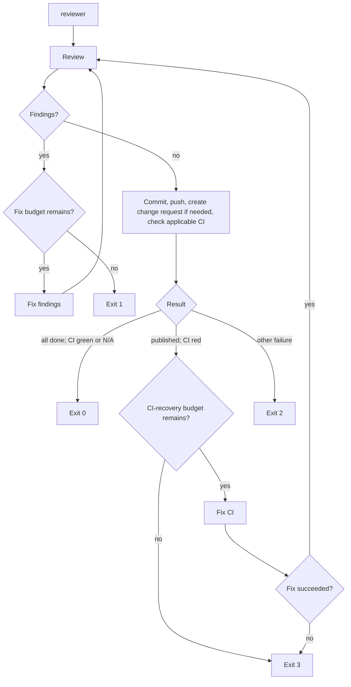

# reviewer

`reviewer` (also known as `review-fixes` and `improver`) is a Go CLI that closes the agent-development loop: it asks an agent to review the current repository, fixes the findings, commits and publishes the result, and makes sure required CI is green when CI applies.

`reviewer` supports [Codex](https://github.com/openai/codex) as its only agent. The command is intended to be run from the repository that should be reviewed.

## Workflow



### 1. Review

`reviewer` runs the normal non-interactive `codex review` command in the current directory. It uses the configured review model; the built-in default is `gpt-5.6-sol` with reasoning effort `medium`.

The review adapter reads the ordinary Codex review report and distinguishes findings from an explicitly clean review. It does not require JSON or a caller-supplied output schema. A non-zero command exit or a report that cannot be classified safely is an operational failure and exits with code `2`; ambiguous output is never treated as a clean review.

For metrics, Codex priorities are normalized as follows: `P0` → `critical`, `P1` → `high`, `P2` → `medium`, and `P3` → `low`. A finding without a recognized priority is counted as `unknown`. `findings_total` must equal the sum of all five counters.

### 2. Fix findings

When the review has findings, `reviewer` starts a fresh Codex session with the configured fix-findings prompt followed by the complete classified review report. This gives the stateless remediation session the findings it must address without forwarding the report to workflow stdout. By default, the prompt is:

```text
fix findings
```

The default model is `gpt-5.6-luna` with reasoning effort `medium`. After a successful agent run, the workflow returns to **Review**.

`max-cycles` is the maximum number of fix-findings attempts in one review phase; its built-in default is `10` and it must be non-negative. The initial review does not consume this budget. After the final allowed fix attempt, `reviewer` always performs one verification review. If that review still has findings, `reviewer` reports that the limit has been reached and exits with code `1`. A failed fix-findings command is an operational failure and exits with code `2`.

### 3. Commit, push, create a change request, and check CI

Once a review returns no findings, `reviewer` asks Codex to finalize the changes. The default prompt is:

```text
commit, push, create PR, ensure CI is green
```

The default model for this stage is `gpt-5.3-codex-spark`. The final agent response must report exactly one of these states:

| State | Meaning | Next action |
| --- | --- | --- |
| `SUCCESS` | Changes are committed and pushed; a change request was created when needed; required CI is green or CI is not applicable. | Exit `0`. |
| `CI_FAILED` | Publication succeeded, but applicable required CI is red. | Run **Fix CI**. |
| `FAILED` | Any other failure (for example, unable to commit, push, or create a PR). | Exit `2`. |

In addition to the single verdict, the final response reports the outcome of `commit`, `push`, `change_request`, and `ci` so `reviewer` can emit the required step records. Missing or internally inconsistent details cannot be interpreted as success and cause an operational failure (`2`).

### 4. Fix CI

When finalization reports `CI_FAILED`, `reviewer` starts Codex with the configured CI-fix prompt. This stage is skipped when the target repository has no applicable required CI. Its built-in prompt is:

```text
Исправь CI
```

If the agent completes successfully, the entire workflow begins again with a new **Review** phase and a fresh `max-cycles` budget, rather than only re-checking CI. The run also has a separate non-negative `max-ci-recoveries` budget, default `3`, to prevent an endless clean-review/failing-CI loop. If the CI-fix command fails, or CI is still red after all recovery attempts have been used, `reviewer` exits with code `3`.

## Exit codes

| Code | Meaning |
| --- | --- |
| `0` | The review is clean; changes are committed and pushed; a change request exists if needed; required CI is green or CI is not applicable. |
| `1` | Review findings remain after the configured maximum number of fix-findings attempts. |
| `2` | An operational/configuration failure occurred, review output was ambiguous, fix-findings failed, or finalization failed for a reason other than red CI. |
| `3` | The CI-fix stage failed or the maximum number of CI-recovery attempts was exhausted. |

## Logging and metrics

During a workflow run, `reviewer` writes operational progress to standard output. Every stage transition and meaningful step is exactly one newline-terminated record. Raw Codex stdout is captured by the adapter and is not forwarded to workflow stdout; diagnostics and human-readable error details go to stderr.

Every record starts with `ts` and `event`. Stage-scoped records also include `stage`; review-loop records include `review_phase` and `cycle`. Completion records include their result and elapsed stage time as defined below.

Records use stable `key=value` fields separated by one ASCII space. Field names contain only lowercase ASCII letters, digits, and underscores. Values must not contain whitespace, `=`, or newlines; free-form text is written to stderr instead. `ts` is UTC RFC 3339, durations are integer milliseconds, and unknown/optional fields are omitted only when the event contract says they are inapplicable.

`review_phase` starts at `1` and increments after every successful CI-fix stage. `cycle` starts at `1` in each review phase. A fix-findings stage uses the same cycle number as the review that produced its input; the next review increments `cycle`. Therefore, with `max-cycles=10`, the last allowed fix uses `cycle=10` and its mandatory verification review uses `cycle=11`. A new review phase resets `cycle` to `1`.

The required event catalog is:

| Event | Required event-specific fields |
| --- | --- |
| `run_started` | No fields beyond `ts` and `event`. |
| `stage_started` | `stage`; also `review_phase` and `cycle` for `review` and `fix-findings`. |
| `review_completed` | `stage=review`, `review_phase`, `cycle`, `status=clean\|findings\|failed`, and `duration_ms`. A classified result (`clean` or `findings`) also requires all findings counters; on command or classification failure the counters are omitted. This is the review stage's sole completion record. |
| `stage_completed` | `stage=fix-findings\|finalize\|fix-ci`, `status=success\|failed`, and `duration_ms`. A successfully parsed finalization response also requires `verdict=SUCCESS\|CI_FAILED\|FAILED`; an invocation or parsing failure uses `status=failed` and omits `verdict`. |
| `step_completed` | `stage=finalize`, `step=commit\|push\|change_request\|ci`, and `status=success\|skipped\|failed\|unknown`. Each finalization attempt emits one record for every listed step; a step that is inapplicable or not reached is `skipped`, while an outcome that cannot be established is `unknown`. |
| `run_completed` | `status=success\|findings_remaining\|operational_failure\|ci_failure`, `exit_code`, and `total_duration_ms`. |

For example:

```text
ts=2026-07-21T10:04:05Z event=stage_started stage=review review_phase=1 cycle=2
ts=2026-07-21T10:06:18Z event=review_completed stage=review review_phase=1 cycle=2 status=findings findings_total=3 findings_critical=0 findings_high=1 findings_medium=2 findings_low=0 findings_unknown=0 duration_ms=133000
ts=2026-07-21T10:06:19Z event=stage_started stage=fix-findings review_phase=1 cycle=2
ts=2026-07-21T10:10:42Z event=stage_completed stage=fix-findings review_phase=1 cycle=2 status=success duration_ms=263000
ts=2026-07-21T10:12:00Z event=step_completed stage=finalize step=change_request status=skipped
```

### Review metrics

Every successfully classified review logs `findings_total` plus `findings_critical`, `findings_high`, `findings_medium`, `findings_low`, and `findings_unknown`. Every counter is present even when its value is `0`. If the review command fails or its report is ambiguous, `status=failed` is emitted with `duration_ms`; finding counters are omitted because no reliable review result exists.

The review-completion record is emitted even when there are no findings, for example:

```text
ts=2026-07-21T10:12:09Z event=review_completed stage=review review_phase=1 cycle=3 status=clean findings_total=0 findings_critical=0 findings_high=0 findings_medium=0 findings_low=0 findings_unknown=0 duration_ms=87000
```

This makes the trend across cycles directly measurable without requiring it to be monotonic: the `findings_*` fields show how the number and severity change, while `duration_ms` measures the cost of each review, fix, finalization, and CI-fix stage. `run_completed` contains `status`, `exit_code`, and `total_duration_ms`.

`reviewer config` is a separate human-readable command and is not part of the workflow event stream.

## Configuration

Every option can be supplied in four places: a command-line flag, an environment variable, project configuration, or user configuration.

Resolution order is highest to lowest priority:

1. Command-line flags
2. Project configuration in `<git-root>/.reviewer/`
3. User configuration in `~/.reviewer/`
4. Environment variables
5. Built-in defaults

This matches the configuration approach of [`start-issue`](https://github.com/dapi/start-issue): a project may pin shared behavior, a user may set personal defaults, and a one-off invocation can override either.

Prompts are file-backed, so they can be reviewed and versioned with project configuration. An absent project/user prompt file means that source has no value and resolution continues. An explicitly supplied CLI or environment path that does not exist is a configuration error and exits `2`. Relative CLI/environment paths are resolved from the current directory; project and user prompt files are resolved inside their respective configuration directories.

### Options and defaults

| Option | Flag | Environment variable | Project / user file | Default |
| --- | --- | --- | --- | --- |
| Maximum fix-findings attempts per review phase | `--max-cycles` | `REVIEWER_MAX_CYCLES` | `max-cycles` | `10` |
| Maximum CI recoveries | `--max-ci-recoveries` | `REVIEWER_MAX_CI_RECOVERIES` | `max-ci-recoveries` | `3` |
| Review model | `--review-model` | `REVIEWER_REVIEW_MODEL` | `review-model` | `gpt-5.6-sol` |
| Review reasoning effort | `--review-reasoning-effort` | `REVIEWER_REVIEW_REASONING_EFFORT` | `review-reasoning-effort` | `medium` |
| Fix-findings model | `--fix-model` | `REVIEWER_FIX_MODEL` | `fix-model` | `gpt-5.6-luna` |
| Fix-findings reasoning effort | `--fix-reasoning-effort` | `REVIEWER_FIX_REASONING_EFFORT` | `fix-reasoning-effort` | `medium` |
| Fix-findings prompt | `--fix-prompt-file` | `REVIEWER_FIX_PROMPT_FILE` | `fix-findings.md` | `fix findings` |
| Finalization model | `--finalize-model` | `REVIEWER_FINALIZE_MODEL` | `finalize-model` | `gpt-5.3-codex-spark` |
| Finalization prompt | `--finalize-prompt-file` | `REVIEWER_FINALIZE_PROMPT_FILE` | `finalize.md` | `commit, push, create PR, ensure CI is green` |
| CI-fix model | `--ci-fix-model` | `REVIEWER_CI_FIX_MODEL` | `ci-fix-model` | agent default |
| CI-fix prompt | `--ci-fix-prompt-file` | `REVIEWER_CI_FIX_PROMPT_FILE` | `fix-ci.md` | `Исправь CI` |

For example, a team can commit these files:

```text
.reviewer/
├── review-model
├── fix-model
├── finalize-model
├── ci-fix-model
├── max-cycles
├── max-ci-recoveries
├── fix-findings.md
├── finalize.md
└── fix-ci.md
```

The same layout in `~/.reviewer/` sets user-level defaults. Environment variables are particularly useful in CI or temporary shell sessions:

```sh
REVIEWER_MAX_CYCLES=3 \
REVIEWER_REVIEW_MODEL=gpt-5.6-sol \
reviewer
```

### Show effective settings

Use the dedicated configuration command to inspect the active configuration:

```sh
reviewer config
```

It prints every setting, its effective value, and its source. Whenever an effective value differs from the built-in default, the built-in default is shown too. This makes overrides and configuration precedence explicit without starting a review.

Example shape of the output:

```text
review-model: gpt-5.6-sol                    (built-in default)
max-cycles:   3                              (project; built-in: 10)
fix prompt:   .reviewer/fix-findings.md      (project; built-in: "fix findings")
```

## Requirements

- Go runtime is not required to run a released binary; it is required to build from source.
- `codex` must be installed, authenticated, and available on `PATH` when running `reviewer`.
- The authenticated account must have access to the configured models; in particular, the default finalization model `gpt-5.3-codex-spark` is not available to every Codex account.
- The target directory must be a Git repository.
- `git` and any tooling or credentials required by the target repository's chosen remote-hosting workflow must be available to the finalization agent. No hosting provider is required by `reviewer`; provider-specific tooling is needed only when the selected finalization actions depend on it.

## Build and install

The supported first-release targets are macOS and Linux on AMD64 and ARM64. Released archives contain a single statically built `reviewer` binary and are accompanied by `SHA256SUMS`; a Go runtime is not required after installation.

Build the current platform binary with Go 1.21.13 or newer:

```sh
make build
```

Build the complete deterministic artifact matrix:

```sh
VERSION=0.1.0 make dist
```

Verify the checksum, extract the archive for the target platform, and copy `reviewer` to a directory on `PATH`, for example `/usr/local/bin` or a user-owned bin directory. No package-manager, registry, signing, or hosted-release channel is currently promised.

## Project documentation

Start with [`memory-bank/README.md`](memory-bank/README.md) for project context and governance. The import/adaptation plan and its acceptance criteria are recorded in [`.protocols/memory-bank-integration.md`](.protocols/memory-bank-integration.md); those documents refer back here instead of duplicating the public CLI contract.
