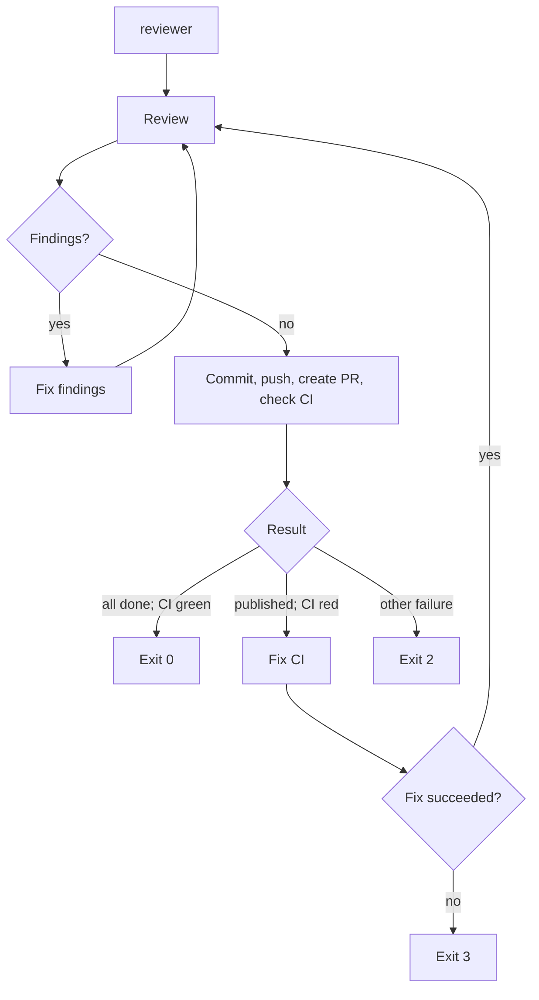

# reviewer

`reviewer` (also known as `review-fixes` and `improver`) is a Go CLI that closes the agent-development loop: it asks an agent to review the current repository, fixes the findings, commits and publishes the result, and makes sure CI is green.

The default agent is [Codex](https://github.com/openai/codex). The command is intended to be run from the repository that should be reviewed.

## Workflow



### 1. Review

`reviewer` runs `codex review` in the current directory with structured output. It uses the configured review model; the built-in default is `gpt-5.6-sol` with reasoning effort `medium`.

The structured result distinguishes review findings from an empty review. An empty review means this stage has succeeded and the workflow continues to publishing changes.

### 2. Fix findings

When the review has findings, `reviewer` starts Codex with the configured fix-findings prompt. By default, the prompt is:

```text
fix findings
```

The default model is `gpt-5.6-luna` with reasoning effort `medium`. After a successful agent run, the workflow returns to **Review**. The default maximum is 10 review/fix cycles.

If findings still remain after the final allowed cycle, `reviewer` reports that the limit has been reached and exits with code `1`. This is an unsuccessful result; it must not silently continue to publishing.

### 3. Commit, push, create PR, and check CI

Once a review returns no findings, `reviewer` asks Codex to finalize the changes. The default prompt is:

```text
commit, push, create PR, ensure CI is green
```

The default model for this stage is `gpt-5.3-codex-spark`. The final agent response must report exactly one of these states:

| State | Meaning | Next action |
| --- | --- | --- |
| `SUCCESS` | Changes are committed and pushed; a PR was created when needed; CI for that PR is green. | Exit `0`. |
| `CI_FAILED` | Commit, push, and PR creation succeeded, but CI is red. | Run **Fix CI**. |
| `FAILED` | Any other failure (for example, unable to commit, push, or create a PR). | Exit `2`. |

### 4. Fix CI

When finalization reports `CI_FAILED`, `reviewer` starts Codex with the configured CI-fix prompt. Its built-in prompt is:

```text
Исправь CI
```

If the agent completes successfully, the entire workflow begins again at **Review**, rather than only re-checking CI. If this stage fails, `reviewer` exits with code `3`.

## Exit codes

| Code | Meaning |
| --- | --- |
| `0` | The review is clean; changes are committed and pushed; a PR exists if needed; CI is green. |
| `1` | Review findings remain after the configured maximum number of cycles. |
| `2` | The finalization stage failed for a reason other than red CI. |
| `3` | The CI-fix stage failed. |

## Logging and metrics

`reviewer` writes operational progress to standard output. Every stage transition and meaningful step is logged as exactly one line, so that a human can follow the run and a CI system can parse its output without multiline records.

Each log line must include at least:

- timestamp;
- event name and stage (`review`, `fix-findings`, `finalize`, or `fix-ci`);
- review cycle number where applicable;
- result/status when the step has completed;
- elapsed time for every completed stage.

The output should use stable key-value fields. For example:

```text
ts=2026-07-21T10:04:05Z event=stage_started stage=review cycle=2
ts=2026-07-21T10:06:18Z event=review_completed stage=review cycle=2 status=findings findings_total=3 findings_critical=0 findings_high=1 findings_medium=2 findings_low=0 duration_ms=133000
ts=2026-07-21T10:06:19Z event=stage_started stage=fix-findings cycle=2
ts=2026-07-21T10:10:42Z event=stage_completed stage=fix-findings cycle=2 status=success duration_ms=263000
```

### Review metrics

Every completed review must log the total number of findings and a count for every severity level returned by the structured review output. At minimum, the standard severity fields are `critical`, `high`, `medium`, and `low`; a missing severity is logged as `0`.

The review-completion record is emitted even when there are no findings, for example:

```text
ts=2026-07-21T10:12:09Z event=review_completed stage=review cycle=3 status=clean findings_total=0 findings_critical=0 findings_high=0 findings_medium=0 findings_low=0 duration_ms=87000
```

This makes the trend across cycles directly measurable: the `findings_*` fields show whether fixes reduce the number and severity of outstanding remarks, while `duration_ms` measures the cost of each review, fix, finalization, and CI-fix stage. Terminal records must also contain the process exit code and total run duration.

## Configuration

Every option can be supplied in four places: a command-line flag, an environment variable, project configuration, or user configuration.

Resolution order is highest to lowest priority:

1. Command-line flags
2. Project configuration in `<git-root>/.reviewer/`
3. User configuration in `~/.reviewer/`
4. Environment variables
5. Built-in defaults

This matches the configuration approach of [`start-issue`](https://github.com/dapi/start-issue): a project may pin shared behavior, a user may set personal defaults, and a one-off invocation can override either.

Prompts are file-backed, so they can be reviewed and versioned with project configuration. A missing file falls through to the next source and ultimately to the built-in prompt.

### Options and defaults

| Option | Flag | Environment variable | Project / user file | Default |
| --- | --- | --- | --- | --- |
| Agent | `--agent` | `REVIEWER_AGENT` | `agent` | `codex` |
| Maximum review/fix cycles | `--max-cycles` | `REVIEWER_MAX_CYCLES` | `max-cycles` | `10` |
| Review model | `--review-model` | `REVIEWER_REVIEW_MODEL` | `review-model` | `gpt-5.6-sol` |
| Review reasoning effort | `--review-reasoning-effort` | `REVIEWER_REVIEW_REASONING_EFFORT` | `review-reasoning-effort` | `medium` |
| Fix-findings model | `--fix-model` | `REVIEWER_FIX_MODEL` | `fix-model` | `gpt-5.6-luna` |
| Fix-findings reasoning effort | `--fix-reasoning-effort` | `REVIEWER_FIX_REASONING_EFFORT` | `fix-reasoning-effort` | `medium` |
| Fix-findings prompt | `--fix-prompt-file` | `REVIEWER_FIX_PROMPT_FILE` | `fix-findings.md` | `fix findings` |
| Finalization model | `--finalize-model` | `REVIEWER_FINALIZE_MODEL` | `finalize-model` | `gpt-5.3-codex-spark` |
| Finalization prompt | `--finalize-prompt-file` | `REVIEWER_FINALIZE_PROMPT_FILE` | `finalize.md` | `commit, push, create PR, ensure CI is green` |
| CI-fix model | `--ci-fix-model` | `REVIEWER_CI_FIX_MODEL` | `ci-fix-model` | agent default |
| CI-fix prompt | `--ci-fix-prompt-file` | `REVIEWER_CI_FIX_PROMPT_FILE` | `fix-ci.md` | `Исправь CI` |

For example, a team can commit these files:

```text
.reviewer/
├── review-model
├── fix-model
├── finalize-model
├── ci-fix-model
├── max-cycles
├── fix-findings.md
├── finalize.md
└── fix-ci.md
```

The same layout in `~/.reviewer/` sets user-level defaults. Environment variables are particularly useful in CI or temporary shell sessions:

```sh
REVIEWER_MAX_CYCLES=3 \
REVIEWER_REVIEW_MODEL=gpt-5.6-sol \
reviewer
```

### Show effective settings

Use the dedicated configuration command to inspect the active configuration:

```sh
reviewer config
```

It prints every setting, its effective value, and its source. Whenever an effective value differs from the built-in default, the built-in default is shown too. This makes overrides and configuration precedence explicit without starting a review.

Example shape of the output:

```text
review-model: gpt-5.6-sol                    (built-in default)
max-cycles:   3                              (project; built-in: 10)
fix prompt:   .reviewer/fix-findings.md      (project; built-in: "fix findings")
```

## Requirements

- Go runtime is not required to run a released binary; it is required to build from source.
- `codex` must be installed, authenticated, and available on `PATH` when using the default agent.
- The target directory must be a Git repository.
- `git` and the tooling/credentials required to push and create pull requests must be available to the finalization agent.
