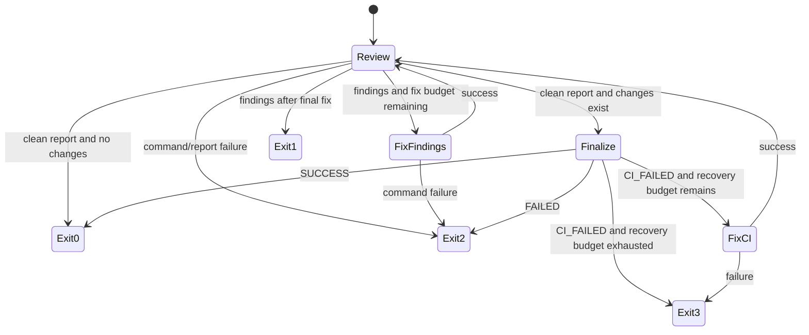

# Workflow States

CI transitions are applicable only when the target repository has required CI. When no required CI exists, finalization reports success with the CI step marked `skipped`. Hosting-provider-specific behavior is an adapter concern, not a domain state.
