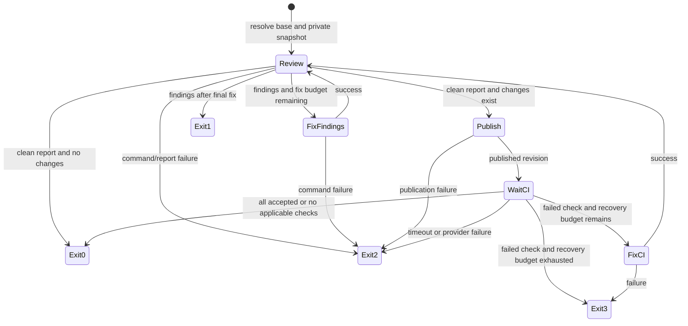

# Workflow States

```mermaid
stateDiagram-v2
  [*] --> Review: resolve base and private snapshot
  Review --> FixFindings: findings and fix budget remaining
  FixFindings --> Review: success
  Review --> Publish: clean report and changes exist
  Review --> Exit0: clean report and no changes
  Review --> Exit1: findings after final fix
  Review --> Exit2: command/report failure
  FixFindings --> Exit2: command failure
  Publish --> WaitCI: published revision
  Publish --> Exit2: publication failure
  WaitCI --> Exit0: all accepted or no applicable checks
  WaitCI --> FixCI: failed check and recovery budget remains
  WaitCI --> Exit3: failed check and recovery budget exhausted
  WaitCI --> Exit2: timeout or provider failure
  FixCI --> Review: success
  FixCI --> Exit3: failure
```

CI polling is pinned to the published head SHA. When GitHub returns no check-runs for that SHA, Code Converge records `skipped`; CI timeout is operational and does not enter Fix CI.
