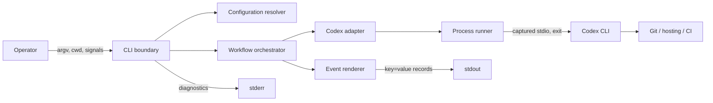

# FT-002: Solution Design

## Selected Design

- `SOL-01` A Go module provides a thin CLI boundary, a single configuration resolver, a process runner, a Codex adapter, a workflow state machine, and a stable event renderer. Dependencies point inward through small interfaces; no third-party runtime dependency is required.
- `SOL-02` All Codex stdout/stderr is captured. Only the event renderer writes workflow stdout; CLI validation and human diagnostics write stderr.
- `SOL-03` Workflow transitions directly encode `domain/states.md`; fix and CI-recovery budgets are separate counters, and each successful CI fix creates a new review phase.
- `SOL-04` Distribution is generated by a deterministic Go build helper for the approved four-target matrix with normalized archive metadata and SHA-256 manifest.

## Design Pack

No separate solution artifact is required. C3, contracts, state semantics, release and verification decisions fit in this document.

## Accepted Local Decisions

- `SD-01` Finalization invokes `codex exec` with a strict JSON Schema and reads only `--output-last-message`. The JSON object has `verdict`, `commit`, `push`, `change_request`, and `ci`; additional/missing fields are rejected.
- `SD-02` Ordinary review accepts findings only from lines beginning with optional Markdown list syntax followed by `[P0]`–`[P3]`. A clean result must match an anchored explicit-clean allowlist after Markdown/whitespace normalization and contain no finding line. Unknown output fails closed.
- `SD-03` Child processes inherit operator Codex sandbox/network/approval configuration. Reviewer adds no timeout/config surface; process cancellation follows the parent context.
- `SD-04` Release baseline is Go `1.21.13`, targets `darwin/linux × amd64/arm64`, `tar.gz` archives, `SHA256SUMS`, and manual PATH installation. No signing, package-manager, hosted release or official registry promise is made.
- `SD-05` Deterministic fake process/corpus tests plus repository CI and independent Codex review are the acceptance authority for this first delivery.

## C4 Applicability Decision

`C4-01: C3 Component required`. The change creates internal component boundaries inside one CLI container and external process connectors, but no new hosted container. The diagram also shows the surrounding actor/systems needed to interpret the C3 connectors.

## Architecture Coverage Decision

| Aspect | Decision | Coverage |
| --- | --- | --- |
| Components | covered | CLI parses command/flags; config resolves values/source; adapter owns Codex protocols; runner owns subprocess mechanics; workflow owns transitions; renderer owns stdout encoding. |
| Connectors | covered | Synchronous local process calls with stdin and captured stdout/stderr; context cancellation terminates a child; finalization uses JSON Schema/last-message files; no raw stream forwarding. |
| Configuration | covered | CLI > project > user > environment > defaults; project root is validated by `git rev-parse --show-toplevel`; prompt file semantics follow the README. |
| Behavioral semantics | covered | Sequential state machine, phase/cycle numbering, verification review and separate budgets are explicit in `SOL-03` and `CTR-03`. |
| Quality/evolution | covered | Fail-closed parsing, deterministic fakes, normalized builds, checksums, no live side effects, and fixture-gated compatibility. |

## Contracts And Invariants

- `CTR-01` Review command: `codex -c model=<model> -c model_reasoning_effort=<effort> review --uncommitted`; exit zero plus classified stdout is required. Recognized findings map `P0/P1/P2/P3` to `critical/high/medium/low`; any other recognized finding priority is `unknown` only when an explicit bracketed priority token is present.
- `CTR-02` Agent command: `codex [model overrides] exec ... -`, with prompt on stdin and captured streams. Finalization adds schema and last-message paths; fix stages do not expose agent output to workflow stdout.
- `CTR-03` Event records contain ordered `key=value` fields with encoded values that reject whitespace, `=`, or newlines. Each started stage has exactly one completion record; each run has exactly one terminal record.
- `CTR-04` Finalization consistency: `SUCCESS` requires every step=`success|skipped`; `CI_FAILED` requires commit/push/change_request=`success|skipped` and ci=`failed`; `FAILED` requires at least one failed/unknown step. `skipped` covers an inapplicable no-change step; invalid combinations are parsing failures.
- `INV-01` `findings_total` always equals the five normalized counters for a classified review.
- `INV-02` A workflow success can only follow a clean review and consistent finalization `SUCCESS`.
- `INV-03` Raw agent output and secrets never pass through event rendering.
- `INV-04` The fix budget counts fixes, not reviews; a successful fix increments cycle before the mandatory next review.

## Failure Modes

- `FM-01` Missing executable, non-zero exit, cancellation, or unclassified review → operational failure (`2`) with failed stage/run records.
- `FM-02` Invalid configuration or non-Git cwd → diagnostic on stderr and operational failure (`2`); no agent stage starts.
- `FM-03` Invalid/missing/inconsistent finalization JSON → four `unknown` step records, failed finalize completion without verdict, exit `2`.
- `FM-04` CI fix failure/exhaustion → `ci_failure`, exit `3`; successful repair restarts review.
- `FM-05` Unsupported build target is absent from the distribution matrix; a failed approved target aborts artifact generation.

## Rollout / Backout

- `RB-01` Rollout unit is a versioned archive plus matching checksum. Installation copies one binary onto PATH. Stop on checksum, install, smoke, or required-CI failure.
- `RB-02` Backout removes/replaces the installed binary with the prior artifact. No persistent state or migration exists. Generated `dist/` is disposable and rebuilt from source.

## Design Verification

| Analysis class | Required | Method | Result / evidence |
| --- | --- | --- | --- |
| Contract compatibility | yes | Root README trace and fixture/golden tests | `CTR-01`–`CTR-04`; planned suites |
| State/transition completeness | yes | Enumerate every state edge and terminal code | `SOL-03`, `INV-02`, `INV-04`, `FM-01`–`FM-04` |
| Failure propagation | yes | Negative configuration/process/parser fixtures | Fail-closed mapping defined above |
| Concurrency/ordering | no | Single sequential state machine | No parallel writer or async connector |
| Security boundaries | yes | Captured stdio, inherited sandbox, no secret rendering | `SOL-02`, `SD-03`, `INV-03` |
| Capacity/latency | no | Bounded attempts; agent duration is externally variable | No product latency target supplied; durations remain observable |
| Migration/evolution safety | yes | Additive fixture compatibility and disposable artifacts | `SD-02`, `RB-01`, `RB-02` |

## Traceability

| Requirement | Solution refs | Contracts / invariants | Failure / rollout refs |
| --- | --- | --- | --- |
| `REQ-01` | `SOL-01` | `CTR-02` | `FM-02` |
| `REQ-02` | `SOL-01`, `SOL-02`, `SD-02` | `CTR-01`, `INV-01`, `INV-03` | `FM-01` |
| `REQ-03` | `SOL-03` | `CTR-03`, `INV-04` | `FM-01` |
| `REQ-04` | `SOL-03`, `SD-01` | `CTR-02`, `CTR-04`, `INV-02` | `FM-03` |
| `REQ-05` | `SOL-03` | `INV-02`, `INV-04` | `FM-04` |
| `REQ-06` | `SOL-02` | `CTR-03`, `INV-03` | `FM-01`–`FM-04` |
| `REQ-07` | `SD-05` | all applicable contracts/invariants | all failure modes |
| `REQ-08` | `SOL-04`, `SD-04` | `INV-03` | `FM-05`, `RB-01`, `RB-02` |
