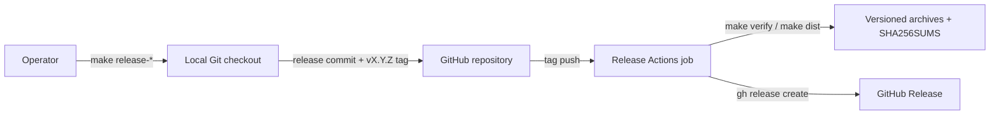

# FT-003: Automated GitHub Releases Design

## Design Pack

| Artifact | Role | Owns |
| --- | --- | --- |
| `design.md` | Feature-local solution owner | `SOL-*`, `C4-*`, `CTR-*`, `INV-*`, `FM-*`, `RB-*` |

## Context

The solution adapts `dapi/start-issue` while retaining code-converge's existing deterministic four-target build helper. The trust boundary is a Git tag granting a workflow `contents: write`; preparation remains an explicit operator action.

## C4 Applicability

`C4-01: C2 Container required` because the change adds a privileged GitHub Actions publication path outside the local CLI runtime.

## Selected Design

- `SOL-01` A root `VERSION` file stores the next/current semantic release identity; `CHANGELOG.md` owns Unreleased and dated version notes.
- `SOL-02` `make release-patch|minor|major` requires a clean checkout, updates `VERSION` and changelog, runs verification/build, then creates a local release commit and annotated tag. Push remains explicit.
- `SOL-03` `.github/workflows/release.yml` runs only for `v*` tags, rejects anything except `vX.Y.Z` matching `VERSION`, and publishes only after repository, checksum, and smoke gates pass.
- `SOL-04` The release uploads the four existing normalized archives and aggregate `SHA256SUMS`; generated GitHub notes supplement the maintained changelog.
- `SOL-05` The build embeds the release version in `internal/version.Version`; `code-converge --version` prints it. A small POSIX installer resolves the latest or pinned release, selects the host target, verifies the matching checksum, and installs to `~/.local/bin` by default.

## Alternatives And Trade-offs

| Alternative | Decision | Trade-off |
| --- | --- | --- |
| GoReleaser | rejected | Duplicates the already tested deterministic archive builder and adds another release contract. |
| Publish on every master push | rejected | Removes the explicit version/approval gate and creates accidental releases. |
| Manual `gh release create` | rejected | Retains the current unrepeatable publication gap. |

## Architecture Coverage Decision

| Aspect | Decision | Coverage |
| --- | --- | --- |
| Components | covered | local preparation scripts, Make targets, deterministic build helper, release workflow, GitHub Release |
| Connectors | covered | explicit Git push/tag event triggers Actions; scoped GitHub token writes release assets |
| Configuration | covered | `VERSION`, `vX.Y.Z`, Go 1.21.13, four fixed targets, `contents: write` only in release workflow |
| Behavioral semantics | covered | prepare locally, push explicitly, validate identity/checks/artifacts, then publish atomically via `gh` |
| Quality/evolution | covered | fail-closed identity, reproducible assets, checksum/smoke gates, patch-forward rollback |

## Contracts And Invariants

- `CTR-01` Release identity is strict numeric `X.Y.Z`; Git tag is exactly `vX.Y.Z`; archive version omits `v`.
- `CTR-02` Assets are `code-converge_X.Y.Z_{darwin,linux}_{amd64,arm64}.tar.gz` and `SHA256SUMS`.
- `CTR-03` Only the release workflow receives `contents: write`; ordinary Verify remains read-only.
- `CTR-04` A release binary prints exactly `code-converge vX.Y.Z` for `code-converge --version`; source builds default to `code-converge vdev`.
- `CTR-05` The installer supports only Darwin/Linux AMD64/ARM64, accepts `CODE_CONVERGE_VERSION=X.Y.Z`, and never installs before checksum verification.
- `INV-01` No publication command executes before `make verify`, artifact build, checksum validation, and Linux AMD64 smoke succeed.
- `INV-02` Implementation work does not itself push a tag or create a hosted release.

## Failure Modes

- `FM-01` Invalid/mismatched tag identity stops at identity verification.
- `FM-02` Test, build, checksum, or smoke failure stops the job before publication.
- `FM-03` Dirty checkout, empty changelog, invalid version, or duplicate tag stops local preparation and restores pre-commit files.
- `FM-04` GitHub permission/API failure leaves source tag and reproducible artifacts but no successful Release; rerun after correcting the external condition.
- `FM-05` Installer platform, download, archive, or checksum failure exits before installation.

## Rollout / Backout

- `RB-01` Rollout requires human approval to push the prepared release commit/tag. Observe the Actions run and verify all five assets before promotion.
- `RB-02` A bad published binary is replaced by a patch release. If urgently necessary, an operator may mark/remove the GitHub Release under separate approval; do not silently mutate versioned assets.

## Design Verification

| Analysis class | Required | Method | Result / evidence |
| --- | --- | --- | --- |
| Contract compatibility | yes | compare existing dist names and start-issue lifecycle | `CTR-01`–`CTR-03` preserve current artifact matrix |
| State/transition completeness | yes | enumerate prepare/tag/gate/publish paths | `SOL-02`, `SOL-03`, `FM-01`–`FM-04` |
| Failure propagation | yes | fail-closed shell/workflow gates | no failure path reaches publication |
| Concurrency/ordering | no | one job per pushed tag; GitHub rejects duplicate release identity | no shared mutable product state |
| Security boundaries | yes | least privilege and non-persistent checkout credentials | only release job has scoped write token |
| Capacity/latency | no | four small static archives | no material capacity concern |
| Migration/evolution safety | yes | additive channel; patch-forward rollback | existing manual artifacts remain reproducible |
