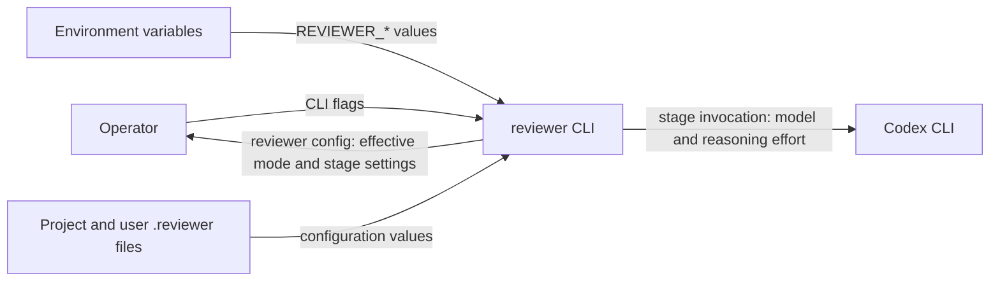

# FT-005: Fast and Best Model Profiles Design

## Design Pack

| Artifact | Role | Owns |
| --- | --- | --- |
| `design.md` | Feature-local solution owner | `SOL-*`, `C4-*`, `SD-*`, `CTR-*`, `INV-*`, `FM-*`, `RB-*` |
| `design.md#c4-applicability` | Embedded C1 System Context view | `C4-01` actor/system boundary and configuration/Codex directions |

## Context

The existing `internal/config` resolver produces effective values and source metadata before workflow execution; `internal/codex` consumes those values for stage invocations. The change extends that existing binding without changing workflow transitions or adding a runtime component.

## C4 Applicability

`C4-01: C1 System Context required` because the feature changes how an operator supplies CLI, environment, and file configuration to reviewer and changes the configuration reviewer sends to the external Codex process. It does not change a deployable/container boundary, so C2 or deeper is not required.



The system boundary is `reviewer CLI`. Operator-controlled arguments, environment, and files are input connectors; human-readable config output is the explainability response; Codex remains the existing external agent process.

## Selected Design

- `SOL-01` Add `mode` as a normal scalar configuration input, resolve it using existing source precedence, validate `fast|best`, and default it to `fast`.
- `SOL-02` Store the two immutable profile maps at the configuration boundary. After resolving mode, resolve each of the eight stage fields independently: highest-priority explicit stage value if any, otherwise the selected profile value.
- `SOL-03` Extend configuration data/source metadata with Finalize and Fix CI reasoning effort; pass all resolved pairs through the existing Codex adapter.
- `SOL-04` Render mode first-class in `reviewer config`; stage fields retain explicit source metadata or receive a profile-derived source that names the effective mode.
- `SOL-05` Update the root README atomically with implementation so the proposed table becomes the operative contract and includes all mode and stage option names/default semantics.

## Accepted Local Decisions

- `SD-01` Mode surfaces are `--mode`, `REVIEWER_MODE`, and project/user file `mode`; values are case-sensitive `fast` and `best`.
- `SD-02` Finalize and Fix CI gain symmetric reasoning-effort surfaces: `--finalize-reasoning-effort` / `REVIEWER_FINALIZE_REASONING_EFFORT` / `finalize-reasoning-effort`, and `--ci-fix-reasoning-effort` / `REVIEWER_CI_FIX_REASONING_EFFORT` / `ci-fix-reasoning-effort`.
- `SD-03` Explicit stage values form an override tier above profiles regardless of the mode's source. Existing precedence applies inside the explicit tier; mode source precedence is resolved independently.
- `SD-04` Profile-derived stage source renders as `<effective-mode> profile`; an explicit value reports its actual source even when equal to the profile value.

## Profile Matrix

`CTR-06` The operative profile matrix is exact:

| Stage | `fast` | `best` |
| --- | --- | --- |
| Review | `gpt-5.6-terra`, `medium` | `gpt-5.6-sol`, `high` |
| Fix findings | `gpt-5.6-luna`, `medium` | `gpt-5.6-terra`, `high` |
| Finalize | `gpt-5.6-luna`, `medium` | `gpt-5.6-luna`, `medium` |
| Fix CI | `gpt-5.6-luna`, `medium` | `gpt-5.6-terra`, `high` |

## Resolution Semantics

```text
effective_mode = first_set(cli, project, user, environment, "fast")
profile = profiles[validate(effective_mode)]

for each stage field:
  effective = first_set(cli, project, user, environment)
  if explicit effective exists:
    value, source = explicit effective
  else:
    value, source = profile[field], effective_mode + " profile"
```

The profile is not appended to the ordinary source list. This preserves the existing ordering among explicit sources and prevents a CLI-selected mode from erasing an environment stage override.

## Architecture Coverage Decision

| Aspect | Decision | Coverage |
| --- | --- | --- |
| Components | covered | C1 actor/system boundary plus `internal/app` flag binding, `internal/config` mode/profile/metadata resolution, `internal/codex` pair consumption, and root README public ownership. |
| Connectors | covered | Operator CLI input, environment/file reads, config output, reviewer → Codex process invocation, and in-process app → resolver → adapter binding; all are synchronous. |
| Configuration | covered | C1 directions plus independent mode resolution, explicit-stage override tier, exact names/values, profile matrix, and source rendering are defined here. |
| Behavioral semantics | covered | Resolution is deterministic before the run and immutable through workflow phases; invalid inputs fail before Codex invocation. |
| Quality/evolution | covered | Central profile table, per-field metadata, full matrix tests, and no implicit escalation keep future modes auditable. |

## Contracts And Invariants

- `CTR-01` Effective mode is exactly `fast` or `best`; an absent value is `fast` from built-in default, while an explicit empty/unknown value is a configuration error.
- `CTR-02` For every stage field: CLI > project > user > environment explicit value > selected profile. Mode itself resolves CLI > project > user > environment > built-in `fast`.
- `CTR-03` Config rendering shows mode/source and all eight effective stage fields/sources; inherited stage sources are `fast profile` or `best profile`, while explicit fields retain their actual explicit source.
- `CTR-04` Every stage passes both `model=<resolved>` and `model_reasoning_effort=<resolved>` to Codex using the existing `-c` argument mechanism.
- `CTR-05` The root README's operative table and options list match the implementation; the old independent model built-ins are no longer described as effective unconfigured defaults after delivery.
- `CTR-06` The exact stage profile values are the matrix above; the `fast` values are also the global built-in baseline used by config's optional `built-in:` comparison.
- `CTR-07` Config's `built-in:` suffix compares the effective string to the global `fast` baseline, independent of source: omit it when equal and show it when different. Mode compares against built-in `fast` by the same value rule. Equal-string explicit overrides remain distinguishable through their explicit source.
- `INV-01` Mode/profile selection does not alter prompts, stage order, workflow budgets, event records, verdicts, or exit codes.
- `INV-02` Resolution is pure with respect to workflow outcomes; no stage mutates another stage's effective settings.

## Alternatives And Trade-offs

| Alternative | Decision | Trade-off |
| --- | --- | --- |
| Source-rank mode against stage overrides | rejected | A high-source mode could erase a lower-source explicit stage override, violating issue acceptance. |
| Profile-only effort for Finalize/Fix CI | rejected | Prevents uniform explicit override and leaves the advertised stage-setting contract asymmetric. |
| Report profile values as ordinary built-in sources | rejected | Loses profile identity and cannot distinguish inherited from explicit equal-string values. |
| Dynamic escalation | rejected | Explicitly non-scope and would couple configuration to runtime outcomes. |

## Failure Modes

- `FM-01` Invalid/empty explicit mode fails configuration before workflow events reach a Codex stage.
- `FM-02` Empty required explicit stage model/effort fails rather than falling through to a profile.
- `FM-03` Incorrect tier ordering silently ignores operator intent; exhaustive cross-dimensional precedence tests guard it.
- `FM-04` A stage omits effort or uses the wrong profile entry; four-stage fake-runner argument tests guard it.
- `FM-05` README, config output, and implementation drift; docs lint plus semantic contract review and config golden tests guard it.

## Rollout / Backout

- `RB-01` Rollout is atomic in one CLI release: config resolver, adapter, tests, and root README change together. Observe required CI and `reviewer config` smoke output before release publication.
- `RB-02` Backout is repository revert/patch release. Existing explicit stage settings remain the compatibility path; no persistent data or migration must be reversed.

## Design Verification

| Analysis class | Required | Method | Result / evidence |
| --- | --- | --- | --- |
| Contract compatibility | yes | compare issue, README, existing source order, config keys, and adapter arguments | `SD-01`–`SD-04`, `CTR-01`–`CTR-07`; explicit settings stay compatible and higher priority |
| State/transition completeness | yes | enumerate default, both modes, eight field fallbacks, four explicit sources, invalid inputs | `SOL-01`–`SOL-04`, `FM-01`–`FM-04`; no runtime state transition changes |
| Failure propagation | yes | trace resolver errors through current app behavior | invalid configuration retains exit `2` and no Codex stage starts |
| Concurrency/ordering | no | resolver runs once before sequential workflow | no concurrent mutable configuration |
| Security boundaries | no | values are non-secret Codex selectors; no auth/trust boundary changes | existing process boundary unchanged |
| Capacity/latency | no | fixed two-profile/eight-field lookup | no material capacity or latency effect |
| Migration/evolution safety | yes | compatibility and backout review | explicit existing configs preserve behavior; unconfigured behavior intentionally changes to `fast`; revert is sufficient |

## Traceability

| Requirement ID | Solution refs | Contracts / invariants | Failure / rollout refs |
| --- | --- | --- | --- |
| `REQ-01` | `SOL-01`, `SD-01`, `C4-01` | `CTR-01`, `CTR-07`, `INV-02` | `FM-01`, `RB-01` |
| `REQ-02` | `SOL-02` | `CTR-02`, `CTR-06`, `INV-02` | `FM-04`, `RB-02` |
| `REQ-03` | `SOL-02`, `SD-03` | `CTR-02` | `FM-02`, `FM-03` |
| `REQ-04` | `SOL-04`, `SD-04` | `CTR-03`, `CTR-07` | `FM-03`, `FM-05` |
| `REQ-05` | `SOL-03`, `SOL-05`, `SD-02` | `CTR-04`–`CTR-06`, `INV-01` | `FM-04`, `FM-05`, `RB-01` |
| `REQ-06` | `SOL-01`–`SOL-05` | `CTR-01`–`CTR-07` | `FM-01`–`FM-05`, `RB-01` |
