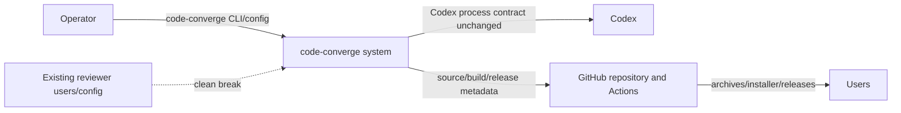

# FT-007: Design

## Design Pack

| Artifact | Role | Owns |
| --- | --- | --- |
| `design.md` | Feature-local solution owner | `SOL-*`, `ALT-*`, `TRD-*`, `C4-*`, architecture coverage, compatibility decision, contracts, invariants, failure modes and rollout/backout |
| `decision-log.md` | Provenance companion | FPF reasoning, source facts, unresolved human gate and review history; it does not own selected solution |

## Context

The feature is an identity migration across a local executable, public configuration, Go module/build graph, repository hosting and release surfaces. The selected solution must preserve workflow semantics while making the new identity coherent and explicitly remove the pre-release reviewer identity.

## C4 Applicability

| C4 ID | Decision | Trigger / reason | Artifact |
| --- | --- | --- | --- |
| `C4-01` | `C1` | The feature changes the operator-facing system identity and its interaction with GitHub/release services; trust and ownership boundaries must be explicit. | Inline system-context below |
| `C4-02` | `C2` | Release archives, installer, CI workflows and repository hosting form affected runtime/build containers and external delivery boundaries. | Inline container map below |

### C4 Artifact

The diagram shows affected boundaries only; execution sequencing belongs to the later implementation plan.

## Architecture Coverage Decision

| Aspect | Status | Canonical owner / refs | Supporting view / artifact | Reason if N/A / coverage note |
| --- | --- | --- | --- | --- |
| Components / responsibilities | covered | `SOL-01`–`SOL-04` | C1/C2 inline maps | CLI identity, config resolver, Go module/build, CI/release and migration docs have distinct responsibilities. |
| Connectors / interactions | covered | `CTR-01`–`CTR-04` | C1/C2 inline maps | CLI/config inputs, Codex process invocation, GitHub links/API, CI/release artifacts and installer distribution are explicit. |
| Configuration / topology | covered | `SOL-02`, `CTR-01`, `CTR-03` | C2 inline map | New command, module, config paths/keys, env names and artifact/repository bindings are selected as one identity set. |
| Behavioral semantics | covered | `INV-01`, `INV-02`, `FM-01`–`FM-03` | `brief.md` scenarios | Workflow state, events, exit codes and Codex semantics remain unchanged; migration behavior is gated by `HG-01`. |
| Quality / evolution concerns | covered | `SD-01`, `RB-01`, `RB-02` | decision log | Compatibility policy, residual-reference classification, external rename approval and backout are explicit. |

## Selected Solution

- `SOL-01` Use `code-converge` as the canonical current project, CLI, binary, Go module and distribution identity; update all current public and delivery references together.
- `SOL-02` Keep one canonical new-name mapping across command, module, config directory/file names, environment variables, configuration keys, URLs, CI, installer and archives. Preserve workflow semantics and event/exit contracts.
- `SOL-03` Classify remaining `reviewer` occurrences as current defect, intentional migration reference, or generic review terminology; do not erase provenance blindly.
- `SOL-04` Treat GitHub repository rename and release/installer publication as externally effective rollout steps approved and owned by `dapi`, with recorded smoke evidence.
- `SOL-05` Apply a clean break: the new command, configuration directory/files, environment variables and keys are the only supported contract; old names are not aliases, fallbacks, or migration inputs.

## Alternatives Considered

| Alternative ID | Option | Why not selected |
| --- | --- | --- |
| `ALT-01` | Rename only the repository/docs while keeping the `code-converge` executable and config contract | Violates issue requirements for public CLI, binary and configuration identity. |
| `ALT-02` | Change code identity without updating release/installer/CI surfaces | Produces a split identity and fails acceptance for artifacts and automation. |
| `ALT-03` | Preserve old names through aliases or migration reads | Rejected: owner explicitly chose a clean break because the project is not in operation. |

## Trade-offs

| Trade-off ID | Decision | Benefit | Cost / Risk |
| --- | --- | --- | --- |
| `TRD-01` | Atomic identity update across local and delivery surfaces | Avoids mixed current names and broken links/artifacts | Larger coordinated change and stricter convergence review. |
| `TRD-02` | Preserve historical references when classified | Retains provenance and avoids false “no old string exists” claims | Inventory must distinguish history from accidental current contract. |
| `TRD-03` | Clean break without compatibility layer | Keeps the new contract coherent and the implementation small | Existing pre-release local setups must be recreated manually. |

## Accepted Local Decisions

- `SD-01` The new canonical identity is the exact lowercase token `code-converge`, matching issue #7; no additional alias is invented for the new name.
- `SD-02` Workflow semantics, exit codes, stdout event schema and Codex integration are invariants, not migration opportunities.
- `SD-03` The compatibility decision covers command, config directories/files, environment variables and configuration keys together; a partial policy would leave mixed-version behavior unspecified.
- `SD-04` `dapi` approved clean break with no aliases, fallback reads, migration tooling, or deprecation period because the project is not in operation.

## Contracts

| Contract ID | Connector / direction | Roles and sync boundary | Guarantees / failure / evolution semantics |
| --- | --- | --- | --- |
| `CTR-01` | Operator → CLI/config | initiator/operator to synchronous local process | New command and config names are canonical; old names are rejected/not read. |
| `CTR-02` | CLI → Codex process | local initiator to synchronous external process | Model, prompts, stdin/stdout/stderr handling and stage semantics remain unchanged except renamed executable/config identity. |
| `CTR-03` | Repository → CI/release/installer | source producer to build/distribution consumers | URLs, module path, workflow references, archive names and installer sources must agree on `code-converge`; stale references fail inventory. |
| `CTR-04` | GitHub repository → users | hosting provider to external consumers | Rename/reachability/redirect behavior is externally effective and requires approved rollout evidence; GitHub redirect is conditional. |

## Invariants

- `INV-01` The rename must not change workflow state transitions, stage order, stdout event schema, exit-code meanings or Codex integration semantics.
- `INV-02` Every current public/delivery identity surface uses one canonical mapping; compatibility and history references are explicitly labeled.
- `INV-03` No external repository rename or release publication occurs before human approval.

## Failure Modes

- `FM-01` Mixed old/new names break users, links or installers; identity inventory and clean-checkout smoke tests detect drift.
- `FM-02` Old-name policy is inconsistent across command/config surfaces; the human gate requires one policy covering all named surfaces.
- `FM-03` Mechanical replacement changes historical evidence or workflow semantics; classification review and regression/contract tests guard it.
- `FM-04` Repository rename or release rollout leaves inaccessible artifacts; approval, reachability/redirect smoke and backout record are required.

## Rollout / Backout

| Stage ID | Stage | Entry condition | Backout |
| --- | --- | --- | --- |
| `RB-01` | Local identity migration | clean-break policy recorded and all local tests/docs agree | Revert local change before merge; after merge publish a corrective release if required. |
| `RB-02` | Repository/release rollout | `dapi` approval, CI green, artifacts and clean-break notes verified | `dapi` owns repository/release rollback or corrective release. |

## Design Verification

| Analysis | Required | Reason / risk | Method | Result / evidence |
| --- | --- | --- | --- | --- |
| Contract compatibility | yes | Public CLI/config/module names and old-name treatment are compatibility-sensitive | source/README/config inventory plus clean-break policy matrix | Pass: `dapi` approved no aliases, fallback reads, or migration inputs. |
| State / transition completeness | yes | Rename must preserve workflow contract | state/event/exit-code regression review | Invariant captured by `INV-01`; implementation evidence pending. |
| Failure propagation | yes | Mixed identity can break links, installers and users | failure-mode and residual-reference analysis | Failure classes captured in `FM-01`–`FM-04`; execution evidence pending. |
| Concurrency / ordering | no | No new concurrent runtime path or shared-writer semantics | architecture review | Not applicable; rename preserves sequential workflow. |
| Security boundaries | yes | Repository hosting and release artifacts are external trust boundaries | ownership/approval boundary review | External action gated by `INV-03`; rollout evidence pending. |
| Capacity / latency | no | Identity-only change has no stated load/latency effect | impact review | Not applicable from issue facts. |
| Migration / evolution safety | yes | A clean break must not leave stale current references or ambiguous mixed identity | compatibility and residual-reference review | Pass for clean break; repository execution is owned by `dapi`. |

## Human Gates

- `HG-01` resolved: `dapi` chose clean break; no aliases, fallback reads, migration tooling, or deprecation period.
- `HG-02` resolved: `dapi` authorizes and owns the external GitHub rename and release/installer rollout.

## Traceability

| Requirement ID | Solution refs | Contracts / invariants | Failure / rollout refs |
| --- | --- | --- | --- |
| `REQ-01` | `SOL-04`, `SD-01` | `CTR-04`, `INV-03` | `FM-04`, `RB-02` |
| `REQ-02` | `SOL-01`, `SOL-02` | `CTR-01`, `INV-01`, `INV-02` | `FM-01`, `RB-01` |
| `REQ-03` | `SOL-02`, `SOL-03` | `CTR-03`, `INV-02` | `FM-01`, `FM-03` |
| `REQ-04` | `SOL-02`, `SD-03`, `SD-04`, `SOL-05` | `CTR-01`, `INV-02` | `FM-02`, `RB-01` |
| `REQ-05` | `SOL-02`, `SOL-04` | `CTR-03`, `CTR-04` | `FM-04`, `RB-02` |
| `REQ-06` | `SOL-02`, `SD-02` | `CTR-02`, `INV-01` | `FM-03`, `RB-01` |
| `REQ-07` | `SOL-03`, `SD-03`, `SD-04` | `CTR-01`, `INV-02` | `FM-02`, `RB-01` |
