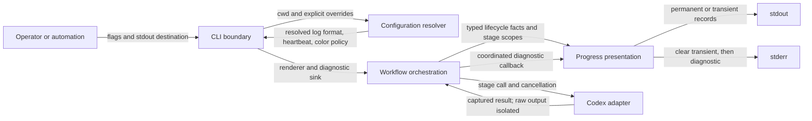

# FT-009: Design

## Design Pack

| Artifact | Role | Owns |
| --- | --- | --- |
| `design.md` | Feature-local solution and embedded C3 owner | `SOL-*`, `ALT-*`, `TRD-*`, `C4-*`, `SD-*`, `CTR-*`, `INV-*`, `FM-*`, `RB-*` |
| `decision-log.md` | Reasoning provenance | Source facts, alternatives, FPF closure and review cycles; no canonical solution facts |
| `../../../README.md` | Public CLI/output contract | Final option names, defaults, human rendering catalog and structured compatibility promise |

## Context

`REQ-01`–`REQ-08` add an operator-oriented presentation above the existing workflow event facts. The design must preserve the stable structured encoder, keep semantic format selection deterministic, bind new settings through the existing resolver, and coordinate a transient/heartbeat worker with permanent stdout records and stderr diagnostics. The workflow state machine remains authoritative for event order and exit outcomes.

## C4 Applicability

`C4-03: C3 Component required and covered inline.` The feature changes collaboration among the existing CLI boundary, configuration resolver, workflow orchestration and event rendering component, and adds concurrency inside the presentation boundary. It introduces no new deployable/container or external system, so C1/C2 add no useful boundary information. Class-level C4 is not required because concrete Go types remain an implementation choice; the required concurrency protocol is specified through `CTR-04` and invariants.

## Architecture Coverage Decision

| Aspect | Decision | Coverage |
| --- | --- | --- |
| Components | covered | `internal/app` detects stdout capability and wires resolved settings; `internal/config` resolves/validates them; `internal/workflow` supplies lifecycle facts and stage scopes; `internal/event` owns human/kv rendering, liveness and serialized output. |
| Connectors | covered | In-process synchronous calls carry typed event/stage facts. A bounded liveness goroutine communicates stop/write errors through a stage-scoped controller. Diagnostics use the same presentation lock to clear transient stdout before stderr output. |
| Configuration | covered | New values use the existing CLI → project → user → environment → default precedence. `NO_COLOR` is a process-environment veto on shimmer, not a second value source for semantic format. |
| Behavioral semantics | covered | `CTR-01`–`CTR-05` define format selection, human mappings, duration/count rules, liveness ordering and write-failure/cancellation behavior. |
| Quality / evolution | covered | `kv` remains the compatibility baseline; human rendering is catalog-driven; structured heartbeat is excluded; clocks, ticker, TTY/capability detection and writers are injectable for deterministic/race testing. |

## Selected Solution

- `SOL-01` Make `human` the built-in default and retain explicit `kv` selection for automation. Rendering consumes the same typed workflow facts; TTY detection never selects the semantic format.
- `SOL-02` Add three settings through the existing resolver: `log-format`, `heartbeat`, and `color`. Their exact public names and values are specified in `CTR-01`.
- `SOL-03` Implement a presentation boundary that owns the unchanged `kv` encoder, the human catalog, duration/severity formatting, terminal capability detection and serialized permanent/transient/diagnostic writes.
- `SOL-04` Scope liveness to human mode. Default TTY behavior is one transient elapsed line; explicit positive heartbeat selects permanent newline heartbeats instead of the transient line. Non-TTY output otherwise emits only permanent records. `kv` never emits heartbeat in this feature.
- `SOL-05` Treat each Codex-backed invocation (`review`, `fix-findings`, `finalize`, `fix-ci`) as a stage scope: start liveness after its permanent start line, stop and join it before completion or diagnostic output, then write the permanent result.
- `SOL-06` Use an injectable monotonic elapsed clock/ticker and a single output coordinator so stage completion, timer ticks, cancellation and writer failures have deterministic ordering and tests need no wall-clock sleeps.

## Alternatives Considered

| Alternative ID | Option | Why not selected |
| --- | --- | --- |
| `ALT-01` | Keep `kv` as the default | Rejected by the explicit product decision to optimize normal operator use. Existing integrations retain the stable stream through explicit `kv` selection. |
| `ALT-02` | Choose human/kv automatically from TTY | Violates deterministic semantic selection required by issue #9. |
| `ALT-03` | Put all progress on stderr | Conflicts with the established contract that workflow progress is stdout and diagnostics are stderr. |
| `ALT-04` | Enable heartbeat in `kv` | Extends the structured event catalog without acceptance need and risks consumer compatibility; separately design it if demanded later. |
| `ALT-05` | Run transient shimmer and explicit heartbeat together | Duplicates liveness, increases noise and complicates ordering. Explicit heartbeat therefore replaces transient display. |
| `ALT-06` | Leave timestamps and model context out of human output | Superseded by the direct operator decision recorded in `DL-12`; the approved human contract needs immediate correlation of each line with its time and executing model. |

## Trade-offs

| Trade-off ID | Decision | Benefit | Cost / Risk |
| --- | --- | --- | --- |
| `TRD-01` | Operator-first `human` default | Normal terminal use is readable without configuration | Existing integrations must explicitly select `kv`. |
| `TRD-02` | Human-only heartbeat | Keeps `kv` byte/schema compatibility and bounds scope | Structured consumers cannot request liveness until a separate contract extension. |
| `TRD-03` | Shared presentation coordinator for stdout/stderr ordering | Prevents transient corruption and late writes | Adds a small synchronization boundary that requires race/failure tests. |
| `TRD-04` | Fixed built-in shimmer policy | Deterministic visuals and tests without theme/config expansion | Palette/frame rate are not user-customizable beyond disabling color. |

## Accepted Local Decisions

- `SD-01` `human` is the default; `kv` is explicit for automation. TTY state never selects the semantic format.
- `SD-02` Human timestamps are unsupported in this delivery. `kv` retains mandatory RFC 3339 `ts` fields.
- `SD-03` Explicit heartbeat is available only in human mode and replaces transient TTY animation; `0` disables heartbeat, positive values below `1s` and invalid/negative durations are configuration errors.
- `SD-04` The color setting has values `auto` and `never`, default `auto`. `NO_COLOR` or `color=never` disables shimmer but not the updating elapsed line. Permanent and heartbeat lines never contain ANSI.
- `SD-05` A soft highlight travels across and then back over the complete transient text; the line refreshes at 10 frames/second, while the highlight advances one character every two frames. Its elapsed timer uses whole seconds and refreshes once per second. Use the fixed true-color palette `#9370c4` base with `#b18fe6`, `#cfb5fa`, `#eadaff` and white highlight steps, approximate it in ANSI-256 terminals, fall back to basic magenta/cyan on lower-color terminals, and emit no color when disabled or terminal capability is unknown/dumb.
- `SD-06` Durations below one minute round to the nearest tenth of a second and trim `.0`; durations of at least one minute round to the nearest second and render compact non-zero `h`, `m`, `s` units. Negative internal durations clamp to zero; human output never uses milliseconds.
- `SD-07` A findings summary always includes total findings and only non-zero severity buckets in the fixed order critical, high, medium, low, unknown.
- `SD-08` `run_started` is omitted in human mode. Every permanent human line begins with local `HH:MM:SS`; each retryable stage line immediately follows it with `[attempt/max] [model/reasoning-effort]`, with no separator before the message. Review and fix-findings use `cycle/max-cycles`; CI recovery uses `review_phase/max-ci-recoveries`. The overall terminal line has neither prefix because it is not stage-scoped. In an interactive terminal, the liveness line replaces the permanent stage-start line; non-TTY keeps the permanent start because it otherwise has no default liveness.
- `SD-09` The selected renderer applies only after `log-format` resolves successfully. Failures before that point use the legacy `kv` startup-failure records where the current contract emits them; a failure in another setting after successful format resolution uses the selected renderer. This avoids guessing an unresolved semantic format and preserves pre-feature failure behavior.

## Contracts

### Configuration contract

| Contract ID | Connector / direction | Roles and sync boundary | Guarantees / failure / evolution semantics |
| --- | --- | --- | --- |
| `CTR-01` | Operator/config → CLI | Existing synchronous resolver | `--log-format`, `CODE_CONVERGE_LOG_FORMAT`, file `log-format`, values `kv|human`, default `human`; `--heartbeat`, `CODE_CONVERGE_HEARTBEAT`, file `heartbeat`, Go-duration value with default/disabled `0`; `--color`, `CODE_CONVERGE_COLOR`, file `color`, values `auto|never`, default `auto`. Existing source precedence applies. Invalid values exit `2` before Codex. Heartbeat with `kv` is rejected instead of silently ignored. |

### Human permanent rendering contract

| Existing event/result | Human rendering |
| --- | --- |
| `run_started` | omitted |
| review `stage_started`, phase 1 | `[<cycle>/<max-cycles>] Review started` (non-TTY only) |
| review `stage_started`, phase >1 | `[<cycle>/<max-cycles>] Review started (phase <phase> after CI recovery <phase-1>)` (non-TTY only) |
| `review_completed status=clean` | `[<cycle>/<max-cycles>] Review: clean (<duration>)` |
| `review_completed status=findings` | `[<cycle>/<max-cycles>] Review: <total> findings — <non-zero severity list> (<duration>)` |
| `review_completed status=failed` | `[<cycle>/<max-cycles>] Review failed (<duration>)` |
| fix-findings `stage_started` | `[<cycle>/<max-cycles>] Fixing findings` (non-TTY only) |
| fix-findings `stage_completed success|failed` | `[<cycle>/<max-cycles>] Findings fixed (<duration>)` or `[<cycle>/<max-cycles>] Fixing findings failed (<duration>)` |
| finalize `stage_started` | `Finalizing` |
| finalization `step_completed` | `  Commit|Push|Change request|CI: done|not needed|failed|unknown`; `success→done`, `skipped→not needed`, other statuses retain their public words |
| finalize `SUCCESS|CI_FAILED|FAILED` | `Finalized successfully (<duration>)`, `Finalized, but CI is failing (<duration>)`, or `Finalization failed (<duration>)` |
| finalize invocation/parsing failure | `Finalization failed (<duration>)`; four step lines still render their emitted `unknown` statuses first |
| fix-ci `stage_started` | `[<phase>/<max-ci-recoveries>] CI recovery` (non-TTY only) |
| fix-ci `stage_completed success|failed` | `[<phase>/<max-ci-recoveries>] CI recovery fixed (<duration>)` or `[<phase>/<max-ci-recoveries>] CI recovery failed (<duration>)` |
| `run_completed success` | `Done (<duration>)` |
| `run_completed findings_remaining` | `Stopped: review findings remain (<duration>, exit 1)` |
| `run_completed operational_failure` | `Failed due to an operational error (<duration>, exit 2)` |
| `run_completed ci_failure` | `Stopped: CI is still failing (<duration>, exit 3)` |

`CTR-02` owns this mapping. Each emitted human permanent line is newline-terminated. A stage failure line and terminal run line are both retained because they answer different operator questions. Human wording is part of the public README contract and changes require explicit compatibility review.

### Formatting and liveness contracts

| Contract ID | Connector / direction | Roles and sync boundary | Guarantees / failure / evolution semantics |
| --- | --- | --- | --- |
| `CTR-03` | Workflow facts → human formatter | Synchronous in-process transform | Applies `SD-06`/`SD-07`; prefixes every permanent line with local `HH:MM:SS`, then retryable stage lines with `[attempt/max] [model/reasoning-effort]`; singularizes `1 finding`; emits no raw keys or zero severity buckets. Interactive human output omits permanent `stage_started` records because its liveness line is the start indication. Unexpected enum values are rendering errors, not improvised prose. |
| `CTR-04` | Stage scope ↔ liveness worker ↔ stdout/stderr | One worker at most; mutex-protected output coordinator; stop-and-join barrier | In human mode with heartbeat `>0`, emit timestamped context-scoped `Review still running`, `Fixing findings still running`, `Finalization still running`, or `CI recovery still running`, followed by `(<elapsed>)`, at interval multiples regardless of TTY and without ANSI. Retryable stages have `[attempt/max] [model/reasoning-effort]`; finalization has its model context only. Otherwise, if stdout is a TTY, update the equivalent timestamped/context-scoped line in place; the elapsed timer changes once per second while a soft color highlight moves across and then back over the fully colored line at a 10 fps refresh rate. Clear transient output before permanent stdout or diagnostic stderr. Stop/join before stage completion, failure or cancellation output. The first worker write error cancels the stage scope and is returned once; no later write is allowed. |
| `CTR-05` | Structured facts → kv encoder | Existing synchronous writer | With `log-format=kv` and heartbeat `0`, record names, fields, ordering, timestamps and integer millisecond durations remain unchanged. No ANSI is ever emitted. |

## Invariants

- `INV-01` Logging presentation cannot change workflow transitions, budgets, review classification, finalization verdicts or process exit codes.
- `INV-02` Exactly one semantic format is selected before workflow execution and remains fixed for the run.
- `INV-03` Every permanent write and transient update is serialized; no liveness write occurs after its stage stop/join barrier.
- `INV-04` A transient line is cleared before any permanent stdout line or stderr diagnostic is written.
- `INV-05` Non-TTY permanent/heartbeat output and all `kv` output contain no ANSI/control sequences.
- `INV-06` Raw Codex output remains captured at the adapter boundary and is never passed to the progress renderer.
- `INV-07` A presentation write failure is an operational failure and cannot be hidden by a later successful write.

## Failure Modes

- `FM-01` The human default changes an existing script's output expectations; explicit `kv` selection and compatibility goldens provide the bounded migration path.
- `FM-02` Timer tick races completion and writes after the result; the stop/join barrier and race tests enforce `INV-03`.
- `FM-03` Transient ANSI corrupts a pipe/file; capability gating and byte-level non-TTY tests enforce `INV-05`.
- `FM-04` Concurrent stderr diagnostic visually interleaves with the transient line; the shared coordinator clears and serializes both sinks.
- `FM-05` Heartbeat interval creates excessive output or busy loops; disabled default and minimum `1s` validation bound frequency.
- `FM-06` A liveness writer failure is lost in a background goroutine; the stage-scoped error/cancel path promotes the first error to exit `2`.
- `FM-07` Human catalog drifts from workflow events; exhaustive enum/table tests and README mapping make omissions visible.
- `FM-08` Color capability is overstated; unknown/dumb terminals fall back to no color while retaining elapsed text.

## Rollout / Backout

| Stage ID | Stage | Entry condition | Backout |
| --- | --- | --- | --- |
| `RB-01` | Release with `human` default | Contract, race, full repository and required CI checks green; high-risk execution approved | Revert the feature commit/release; automation can select `kv` without data migration. |
| `RB-02` | Automation compatibility | Explicit `--log-format=kv` or config selection | Remove the explicit setting to return to the human default. |

## Design Verification

| Analysis | Required | Reason / risk | Method | Result / evidence |
| --- | --- | --- | --- | --- |
| Contract compatibility | yes | Public stdout/config has existing consumers | Baseline contract comparison and alternatives review | User-approved default change; `kv` remains byte-compatible when explicitly selected; `CTR-01`, `CTR-02`, `CTR-05`. Execution evidence pending. |
| State / transition completeness | yes | Every event/result and terminal path needs human coverage | Cross-check current README catalog and workflow branches | Pass at design: all catalog/branch outcomes mapped in `CTR-02`; exhaustive tests planned. |
| Failure propagation | yes | Background and permanent writer errors must remain terminal | Failure-mode analysis over start/tick/stop/diagnostic/completion | Pass at design: first-error cancellation and operational exit in `CTR-04`, `INV-07`, `FM-02`–`FM-06`. |
| Concurrency / ordering | yes | Liveness races completion/cancellation/diagnostics | Happens-before review with single worker, coordinator lock and stop/join | Pass at design: `INV-03`/`INV-04`; deterministic and race evidence required during execution. |
| Security boundaries | yes | Raw agent output and terminal control bytes are trust concerns | Data-flow/isolation review | Pass at design: `INV-05`/`INV-06`; byte-level tests pending. |
| Capacity / latency | yes | Shimmer/heartbeat can consume CPU or flood logs | Fixed-rate and minimum-interval bound review | Pass at design: 10 fps transient, heartbeat disabled by default and minimum `1s`; no unbounded queue. |
| Migration / evolution safety | yes | Existing automation must make an explicit format choice | Default/rollback/extension review | Pass at design: explicit `kv`, documented rollback and `RB-01`/`RB-02`; no data migration. |

## Human Gates

- `HG-01` No unresolved product/design ambiguity blocks the document package. High-risk profile approval remains an execution approval gate (`AG-01` in the plan), not an unresolved contract question.

## Traceability

| Requirement ID | Solution refs | Contracts / invariants | Failure / rollout refs |
| --- | --- | --- | --- |
| `REQ-01` | `SOL-01`, `SOL-02` | `CTR-01`, `INV-02` | `FM-01`, `RB-02` |
| `REQ-02` | `SOL-03` | `CTR-02`, `CTR-03` | `FM-07` |
| `REQ-03` | `SOL-01` | `CTR-05`, `INV-01` | `FM-01`, `RB-01` |
| `REQ-04` | `SOL-04`, `SOL-06` | `CTR-04`, `INV-03`, `INV-04` | `FM-02`, `FM-04`, `FM-08` |
| `REQ-05` | `SOL-02`, `SOL-04` | `CTR-01`, `CTR-04`, `INV-05` | `FM-03`, `FM-05` |
| `REQ-06` | `SOL-05`, `SOL-06` | `CTR-04`, `INV-03`, `INV-07` | `FM-02`, `FM-06` |
| `REQ-07` | `SOL-03` | `INV-04`, `INV-06` | `FM-04` |
| `REQ-08` | `SOL-02`, `SOL-03` | `CTR-01`, `CTR-02`, `CTR-05` | `RB-01` |
