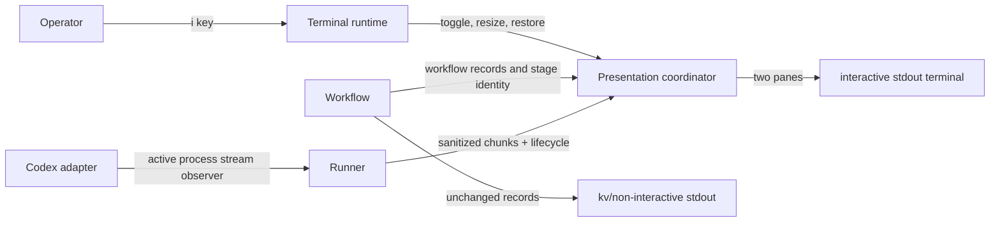

# FT-010: Design

## Design pack

| Artifact | Role | Owns |
| --- | --- | --- |
| `design.md` | Feature-local solution owner | `SOL-*`, `ALT-*`, `TRD-*`, `C4-*`, `SD-*`, `CTR-*`, `INV-*`, `FM-*`, `RB-*` |
| `decision-log.md` | Reasoning provenance | source facts, alternatives, FPF closure, review cycles; no canonical solution facts |
| `../../../README.md` | Public contract | delivered prerequisite, keys, fallback, stream-isolation, and compatibility wording |
| `../../adr/ADR-001-interactive-terminal-runtime.md` | Reusable runtime decision | terminal detection/raw mode/restoration boundary |

## Context

`REQ-01`–`REQ-08` add a terminal-only operator surface above the existing typed workflow facts. The workflow state machine remains authoritative. The runner must change from after-exit capture to a streamed, observer-capable process boundary without forwarding raw bytes to workflow stdout. The presentation boundary owns pane rendering and key handling.

## C4 applicability

`C4-03: C3 Component required and covered inline.` Existing CLI/app wiring, runner, Codex adapter, workflow, and event presentation gain new collaboration and a terminal runtime; no new deployable, container, external system, or API boundary is introduced.

## Architecture coverage decision

| Aspect | Decision | Coverage |
| --- | --- | --- |
| Components | covered | App wires terminal eligibility; runner streams process chunks; Codex adapter identifies active agent; workflow supplies stage identity; event/presentation owns panes and serialized terminal writes; ADR-001 owns terminal mode. |
| Connectors | covered | In-process observer callbacks transfer bounded byte chunks to a sanitizer and pane buffer; typed workflow facts use existing synchronous path; a terminal event loop serializes key, resize, stream, and completion events. |
| Configuration | N/A | No flag or persistent setting is added. Eligibility is runtime-only and cannot select the semantic log format. |
| Behavioral semantics | covered | `CTR-01`–`CTR-03` define eligibility, keys, pane state, stream replacement, sanitization, and restoration. |
| Quality / evolution | covered | Bounded buffers, injectable terminal/clock/stream fakes, conservative fallback, and a narrow `x/term` dependency keep behavior testable and portable. |

## Selected solution

- `SOL-01` Add an interactive terminal presentation mode only for `human` logging when both stdin and stdout are terminals and `TERM` is neither empty nor `dumb`. It is an additive rendering mode, not a semantic format or configuration setting.
- `SOL-02` Pressing `i` toggles the split view. The same key closes it; no agent is restarted, cancelled, or otherwise affected. Ineligible runs ignore input and preserve current output.
- `SOL-03` Render a top workflow pane and a bottom agent pane with independently bounded logical-line scrollback. Arrow/Page keys scroll the focused pane; `Tab` changes focus; `End` returns that pane to live tail. Pane focus and key bindings appear in a one-line footer.
- `SOL-04` Stream both active-agent stdout and stderr through independently identified observer chunks, preserving their arrival order at the presentation boundary. The sanitizer strips ANSI escape/control sequences except newline and tab, then normalizes invalid UTF-8; stderr chunks receive a `[stderr]` prefix. The lower pane labels each stream with stage name and attempt; a new active process clears the prior live pane and writes its identity, so streams cannot be mixed.
- `SOL-05` When no agent is active, the split view may still open and shows an explicit `No active agent output` state. Completion freezes the last stream with its terminal state; errors append only a safe diagnostic summary, not an unsanitized stderr payload.
- `SOL-06` Use the narrow `golang.org/x/term` terminal runtime accepted by ADR-001. It owns raw mode, resize events, and one idempotent restore path; the repository owns all pane/layout/rendering code.

## Alternatives considered

| Alternative ID | Option | Why not selected |
| --- | --- | --- |
| `ALT-01` | Require an explicit interactive flag | Adds a public configuration surface although Issue 10 already scopes the behavior to interactive terminal runs; eligibility gates preserve existing non-TTY behavior. |
| `ALT-02` | Separate close key | Conflicts with the issue title's toggle wording and increases the public key surface without an identified need. |
| `ALT-03` | Preserve ANSI/raw agent bytes | Can corrupt the pane or terminal and conflicts with the existing raw-output isolation principle. |
| `ALT-04` | Unbounded scrollback | Makes long runs memory-unbounded and weakens deterministic tests. |
| `ALT-05` | Full TUI framework | Larger dependency/runtime surface than the two-pane requirement; ADR-001 selects a narrower terminal primitive. |

## Trade-offs

| Trade-off ID | Decision | Benefit | Cost / risk |
| --- | --- | --- | --- |
| `TRD-01` | Auto-enable only when conservatively eligible | No new flag and no changed non-interactive behavior | Some capable terminals may use the existing output instead. |
| `TRD-02` | Sanitized plain-text stream | Terminal safety and deterministic rendering | Loses agent color and other terminal styling. |
| `TRD-03` | Bounded scrollback | Predictable memory and tests | Earlier output may age out. |

## Accepted local decisions

- `SD-01` Eligibility requires human format, terminal stdin/stdout, and a non-dumb `TERM`; failed eligibility is silent fallback to existing permanent output.
- `SD-02` `i` is the sole open/close toggle. `Tab`, arrows/PageUp/PageDown, and `End` are view-local navigation keys; all other input is ignored by the view.
- `SD-03` The top and bottom panes each retain the most recent 2,000 sanitized logical lines. Long logical lines soft-wrap to pane width; resize reflows retained logical lines without counting wrapped fragments against the bound.
- `SD-04` The view starts at the live tail. Scrolling a pane detaches only that pane from its live tail; `End` returns it to tail.
- `SD-05` Sanitization removes terminal control sequences and non-printing controls except tab/newline, renders invalid UTF-8 as replacement characters, and never writes raw agent bytes to workflow stdout.
- `SD-06` The active stream identity is `(stage, review phase, cycle/attempt, process sequence)`. It changes atomically before first chunk of a new process; prior completed output remains only until the next process begins.
- `SD-07` Terminal restoration is idempotent and runs before final permanent output on normal completion, cancellation, interruption, panic, setup failure, and presentation-write failure.

## Contracts

| Contract ID | Connector / direction | Guarantees and failure/evolution semantics |
| --- | --- | --- |
| `CTR-01` | App/runtime → presentation | Capability check happens before raw mode. If ineligible or setup fails, no view starts and existing output continues. On eligibility, the runtime emits normalized key/resize events and always exposes restore. |
| `CTR-02` | Runner/Codex → presentation | Stdout and stderr chunks are delivered while the active process runs, retain their source label, and enter the presentation queue in observer-arrival order. They are sanitized before buffering/rendering and tagged with one stream identity. Process completion/error closes that identity; no callback may update a later stream. Existing separate final stdout/stderr capture remains available to the Codex boundary. |
| `CTR-03` | Workflow facts → presentation | Workflow records append to the top pane and retain their normal output ownership. Pane open/close and repaint never alter workflow transition, process context, exit status, or `kv` encoding. |

## Invariants

- `INV-01` Interactive keys and repainting cannot interrupt, restart, or mutate workflow state.
- `INV-02` `kv` and all non-interactive stdout remain free of terminal controls and raw agent output.
- `INV-03` At most one active stream identity can receive rendered chunks; stale chunks are discarded, and visible stderr chunks retain their `[stderr]` source label.
- `INV-04` Terminal restore runs once effectively and precedes subsequent permanent terminal output.
- `INV-05` Pane buffers are bounded and their updates are serialized with key, resize, completion, and cleanup events.

## Failure modes

- `FM-01` Terminal setup/raw mode fails: retain existing output and do not consume input.
- `FM-02` Resize/key/stream races: the presentation event loop serializes events and stale stream identities are ignored.
- `FM-03` Agent output contains escape sequences or invalid bytes: sanitize before buffering; preserve only safe text.
- `FM-04` Process finishes during a toggle: completion event wins stream identity and view stays usable with frozen state.
- `FM-05` Panic/interruption/write error leaves raw mode active: deferred idempotent restoration executes before diagnostic/final rendering.

## Rollout / backout

| Stage ID | Stage | Entry condition | Backout |
| --- | --- | --- | --- |
| `RB-01` | Release interactive view | Deterministic, race, manual-smoke, docs, and CI evidence pass. | Revert feature release; non-interactive contracts need no data migration. |

## Design verification

| Analysis | Required | Method | Result |
| --- | --- | --- | --- |
| Contract compatibility | yes | Compare `CTR-01`/`CTR-03` to current README logging contract. | Pass at design: eligibility cannot choose format; `kv` remains isolated. |
| State / transition completeness | yes | Exercise open, close, inactive, stream replacement, completion/error, resize, scroll, cancel, and panic state matrix. | Pass at design; deterministic execution evidence pending. |
| Failure propagation | yes | Trace setup, stream, terminal-write, cancellation, and panic through `FM-*`/`INV-04`. | Pass at design; cleanup tests pending. |
| Concurrency / ordering | yes | Model event-loop serialization and stale identity checks. | Pass at design; race tests pending. |
| Security boundaries | yes | Inspect sanitizer and stdout isolation contract. | Pass at design: no raw terminal-control bytes reach panes/stdout; implementation tests pending. |
| Capacity / latency | yes | Bounded 2,000-line buffers and chunk-event coalescing tests. | Pass at design; performance evidence pending. |
| Migration / evolution safety | no | No persistent data, schema, or file format changes. | N/A. |
