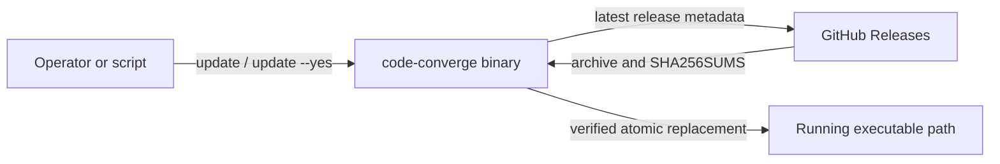

# FT-012: Design

## Design Pack

| Artifact | Role | Owns |
| --- | --- | --- |
| `design.md` | Feature-local solution owner | `SOL-*`, `C4-*`, `CTR-*`, `INV-*`, `FM-*`, `RB-*` |

## Context

The updater must use the GitHub Release conventions already consumed by `scripts/install.sh`, while adding confirmation and preserving the running executable on every no-change/error path. The CLI's existing app boundary owns argument dispatch and output writers, so the updater is injected below it for deterministic tests.

## C4 Applicability

`C4-01: C1 System Context required.` The change adds a directionally significant connector from a local CLI to GitHub Releases and changes a user-facing executable boundary. C2/C3 diagrams are not required: one Go binary remains the only runtime container and the component split is adequately described below.

## Selected Solution

- `SOL-01` Add an `internal/update` package that receives injected platform, executable path, HTTP transport, stdin/stdout/stderr and filesystem operations through a narrow service boundary; `app.App` dispatches `update` before workflow/config processing.
- `SOL-02` Map only the existing supported targets: `darwin/linux` with `amd64/arm64`; derive archive name `code-converge_<version>_<os>_<arch>.tar.gz` and require matching release assets for archive and `SHA256SUMS`.
- `SOL-03` Fetch `/repos/dapi/code-converge/releases/latest`, reject `prerelease`, malformed `v?MAJOR.MINOR.PATCH` versions and non-newer versions. Equal/older releases return success with no download.
- `SOL-04` Emit release status/notes or release URL and prompt `Install update? [y/N]: ` to stdout. Only trimmed case-insensitive `y`/`yes` proceeds. `--yes`/`-y` skips and never reads stdin. Current or declined outcomes return `0`; every updater operational error emits a prefixed diagnostic to stderr and returns `2`.
- `SOL-05` Download archive and checksum into a private temporary directory, parse only the exact archive entry in `SHA256SUMS`, stream/verify SHA-256, extract one regular `code-converge` file, and install a staged same-directory replacement with executable mode before atomic rename.

## Architecture Coverage Decision

| Aspect | Decision |
| --- | --- |
| Components | `app` dispatches; `update.Service` owns orchestration; injected release client/filesystem performs external I/O. |
| Connectors | HTTPS GET to GitHub API/release asset URLs; local filesystem temporary staging and rename. |
| Configuration | No persistent configuration; command flags are local. Existing release owner supplies repository/matrix/naming. |
| Behavioral semantics | Discovery → no-update/preview → confirmation → downloads → checksum → extract/stage → rename; no mutation before final rename. |
| Quality/evolution | Injections make adverse cases deterministic; exact target/checksum matching avoids asset confusion; no new reusable project policy. |

## Contracts and Invariants

- `CTR-01` GitHub metadata is accepted only when it identifies a newer stable semantic version and contains the exact target archive plus `SHA256SUMS` assets.
- `CTR-02` The checksum parser accepts only an exact checksum record for the target archive; missing, malformed or mismatch is operational failure.
- `CTR-03` stdout contains statuses, notes/URL and prompt; stderr contains diagnostics. No confirmation read occurs under `--yes`.
- `INV-01` No path mutates the running executable before an affirmative confirmation (unless `--yes`) and fully verified archive/checksum.
- `INV-02` A failed download, parse, extraction, staging, permission change or rename preserves the destination bytes.
- `INV-03` The final install uses a same-directory atomic rename of a staged regular executable; no partial destination is exposed by updater-controlled writes.

## Failure Modes and Rollback

| Failure | Handling |
| --- | --- |
| Unsupported host/current `dev`/malformed metadata | stderr diagnostic, exit `2`, no download or mutation. |
| Current/equal/older release or declined confirmation | stdout status, exit `0`, no mutation. |
| Missing asset, HTTP/download/checksum/extraction failure | stderr diagnostic, exit `2`, remove temporary files, preserve destination. |
| Staging/rename/permission failure | stderr diagnostic, exit `2`, remove stage, preserve destination. |

- `FM-01` If a rename reports an error, report operational failure; do not attempt a destructive recovery write.
- `RB-01` Before the final rename the old binary remains the rollback artifact. After a successful atomic rename, recovery is reinstalling the prior known release with the existing installer; no automatic downgrade is introduced.

## Risk-Based Design Verification

| Analysis | Required | Method / result |
| --- | --- | --- |
| Contract compatibility | yes | App/CLI tests and README contract matrix cover flags, exit and streams. |
| State/transition completeness | yes | Table-driven service tests cover each decision and terminal path. |
| Failure propagation | yes | Fake transport/filesystem tests prove `INV-02`. |
| Concurrency/ordering | no | Command is synchronous; no concurrent writer or updater worker is introduced. |
| Security boundaries | yes | Exact assets/checksum, regular-file extraction and no pre-verification mutation are tested. |
| Capacity/latency | no | One bounded release metadata and two asset downloads; no new background load. |
| Migration/evolution safety | yes | Release-asset smoke validates the existing matrix/names; `RB-01` defines recovery. |
