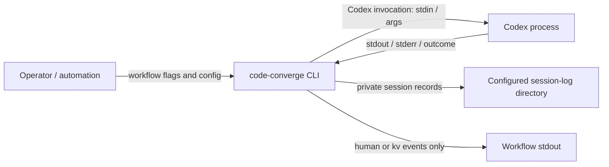

# FT-014: Design

## Design Pack

| Artifact | Role | Owns |
| --- | --- | --- |
| `design.md` | Feature-local solution owner | `SOL-*`, `SD-*`, `C4-*`, `CTR-*`, `INV-*`, `FM-*`, `RB-*` |

## Context

The existing process boundary already receives every Codex invocation's stdin, stdout, stderr and outcome, while the workflow logger deliberately keeps raw streams out of its public event stream. The feature adds a private, local diagnostic carrier without changing that authority boundary.

## C4 Applicability

`C4-01: C2 Container required.` The change adds an owned local persistent-storage boundary and a filesystem cleanup connector. The binary remains one runtime container; C3 and C4 diagrams would not make the selected behavior clearer.

## Selected Solution

- `SOL-01` Add three configuration values using the existing precedence and effective-setting display: `--session-log-dir` / `CODE_CONVERGE_SESSION_LOG_DIR` / `session-log-dir`, `--session-log-retention` / `CODE_CONVERGE_SESSION_LOG_RETENTION` / `session-log-retention`, and boolean `--no-session-log`. The built-in directory is `~/.code-converge/session-logs`; the built-in retention is `24h`.
- `SOL-02` Require `session-log-dir` to be a non-empty absolute path after leading-`~` expansion; reject relative or otherwise invalid values. Parse retention as a Go duration of at least one second; reject `0` and negative values. Operators use `--no-session-log` when they need no artifacts, avoiding an ambiguous disabled-retention state.
- `SOL-03` Create a `0700` log root where platform permissions permit, then one private `0700` directory per enabled workflow named `session-<UTC-unix-nanoseconds>-<pid>-<random>`. The random suffix is cryptographically generated. Each record is written atomically as a `0600` JSON file: `session.json` for session lifecycle and one zero-padded invocation file per Codex call. A session-local monotonically increasing sequence orders invocations; a session directory is never shared by workflows.
- `SOL-04` Wrap the Codex process runner at the app boundary. Around each Codex call, it writes redacted stdin, stdout, stderr, exit/error outcome, stage, review phase, cycle, model, reasoning effort, timestamps and duration as one atomic invocation record. It never records the `Env` field or any parent process environment values.
- `SOL-05` Redact every serialized text field before persistence. Redact complete values supplied by command arguments or text whose case-insensitive key contains `token`, `secret`, `password`, `api-key`, `apikey`, `authorization` or `cookie`, including a credential flag's following argument; redact bearer credentials and GitHub-token prefixes (`ghp_`, `gho_`, `ghs_`, `ghr_`, `github_pat_`) wherever they occur. Redaction replaces the value with `[REDACTED]`. The README must warn that repository content, prompts, paths and arbitrary agent output can still be sensitive; `--no-session-log` is the explicit no-artifact control.
- `SOL-06` On enabled-run startup, create the session directory and run best-effort cleanup by enumerating only direct child directories of the effective root. Cleanup ignores non-session names and never follows symlinks; it requires `session.json` itself to be a regular, non-symlink file and removes only verified sessions with an atomically recorded completion time older than the effective retention. Incomplete, unreadable or malformed sessions are retained to avoid deleting an active concurrent workflow. Cleanup failure writes a prefixed diagnostic to stderr but does not change a workflow result or delete the current session.
- `SOL-07` A session-log create/write/permission failure writes a prefixed diagnostic to stderr and continues the workflow. If initial metadata creation fails, the newly created session directory is removed so an incomplete artifact cannot evade retention cleanup. The session writer makes no event-stream writes and does not change the workflow exit code; `--no-session-log` constructs no session writer and performs no directory creation or cleanup.
- `SOL-08` When `log-format=human` and an enabled session directory has been created, emit exactly one initial permanent `HH:MM:SS Session log: <canonical path>` line through the human renderer. Do not emit it for `kv` or `--no-session-log`; it contains only the path, never session data.

## Architecture Coverage Decision

| Aspect | Decision |
| --- | --- |
| Components | `app` constructs the session service; a runner decorator captures Codex calls; the session writer owns private records and cleanup; the existing workflow/event logger remains public-stream owner. |
| Connectors | In-process runner decorator; filesystem create/write/rename/list/remove connector to the configured directory; stderr diagnostics. |
| Configuration | Existing resolver supplies two string settings and the per-run boolean override. Paths are normalized before filesystem operations; retention is validated before workflow startup. |
| Behavioral semantics | Enabled: create session → cleanup old siblings → record each invocation in sequence → complete session. Disabled: do none of those actions. Write/cleanup failure: stderr diagnostic, retain normal workflow control flow. |
| Quality/evolution | Per-session isolation prevents collisions; atomically written `0600` records avoid partial visible records; redaction and omitted environments narrow exposure. The data is local only and has a bounded default lifetime. |

## Accepted Local Decisions

- `SD-01` The public names are `session-log-dir`, `session-log-retention` and `--no-session-log`; they follow the existing flag/environment/file naming convention and preserve the issue's stated opt-out intent.
- `SD-02` `0` retention is invalid, rather than immediate or unlimited retention. Immediate cleanup contradicts a useful diagnostic record and unlimited retention increases exposure; opt-out already expresses no logging.
- `SD-03` Create/write failures are warning-only stderr diagnostics, not a new workflow failure mode. The diagnostics are auxiliary, and a fatal result would change the public workflow outcome even when Codex work succeeds; cleanup already has this non-fatal rule in the issue.
- `SD-04` Session-directory isolation plus a random suffix is selected over one append-only shared file because concurrent workflows need independent atomic ownership and cleanup boundaries.

## Contracts and Invariants

| Contract ID | Connector / direction | Roles and sync boundary | Guarantees / failure / evolution semantics |
| --- | --- | --- | --- |
| `CTR-01` | Runner decorator → session writer | Synchronous in-process call before/after each Codex invocation | Records only Codex calls, preserves invocation order per session, and never reinterprets streams as review results. |
| `CTR-02` | Session writer → configured filesystem root | Synchronous local filesystem connector | Root/session/file privacy modes apply where supported; writer atomically publishes `0600` JSON records; no environment values are serialized. |
| `CTR-03` | Session service → stderr | Diagnostic-only, synchronous | Create/write/cleanup failures emit a prefixed diagnostic and do not emit workflow events or alter workflow exit semantics. |

- `INV-01` Raw Codex stdout/stderr never reaches workflow stdout; session records are a separate private carrier.
- `INV-02` `--no-session-log` produces no session-log root, cleanup or record artifact for its run.
- `INV-03` Cleanup is confined to verified completed direct session-directory children of the effective root and never follows symlinks.
- `INV-04` Process environment values and recognized authentication credentials are absent or redacted in every persisted record.
- `INV-05` A failure to create or write diagnostics cannot discard a successful workflow result or make cleanup delete a current session.
- `INV-06` The human path handoff is emitted once only after session creation; it is absent from `kv` and opt-out runs and contains no raw session content.

## Failure Modes and Rollback

| Failure | Handling |
| --- | --- |
| Invalid path or retention configuration | Reject during config loading with the existing operational configuration error path; no workflow starts. |
| Root/session/file create or atomic write failure | Emit prefixed stderr diagnostic, continue workflow; retain any already published records. |
| Cleanup list/stat/remove failure | Emit prefixed stderr diagnostic, continue workflow; never attempt cleanup outside the root or on the current session. |
| Random suffix generation failure | Emit prefixed stderr diagnostic, continue workflow without a session record. |
| Unsupported permission semantics | Create records normally, attempt owner-only modes where supported and document the platform limitation. |

- `FM-01` A partially written record must remain unpublished: write a temporary file inside its owned session directory and atomically rename it only after the serialized content is complete.
- `RB-01` Removing the session-log configuration/runner decorator restores the previous no-retention behavior. Operational recovery for an unwanted record is deletion by the local owner from the configured directory; automatic cleanup remains bounded by `INV-03`.

## Design Verification

| Analysis | Required | Reason / risk | Method | Result / evidence |
| --- | --- | --- | --- | --- |
| Contract compatibility | yes | New CLI/config/config-output and stdout/stderr contracts | Table tests for every source, flag and invalid value; README contract review | `CHK-02`, `CHK-04`, `CHK-05` |
| State / transition completeness | yes | Enabled/disabled and pre/post-invocation lifecycle | Deterministic workflow scenario walk-through | `CHK-01`, `CHK-04` |
| Failure propagation | yes | Diagnostic persistence must not change workflow outcome | Filesystem failure injection and stderr/output assertions | `CHK-03`, `CHK-05` |
| Concurrency / ordering | yes | Simultaneous workflows and ordered multi-call record | Parallel deterministic tests and sequence assertions | `CHK-01`, `CHK-05` |
| Security boundaries | yes | Potentially sensitive durable data and local permissions | Redaction, no-environment, permissions and symlink-safe cleanup tests | `CHK-03`, `CHK-05` |
| Capacity / latency | no | No background service and one bounded local write per Codex invocation | N/A; normal process output is already captured in memory by the runner | N/A |
| Migration / evolution safety | yes | New configuration/default data layout must remain bounded | Config default/validation and cleanup-boundary tests | `CHK-02`, `CHK-03` |

## Traceability

| Requirement ID | Solution refs | Contracts / invariants | Failure / rollout refs |
| --- | --- | --- | --- |
| `REQ-01`, `REQ-02` | `SOL-03`, `SOL-04`, `SD-04`, `C4-01` | `CTR-01`, `CTR-02`, `INV-01` | `FM-01`, `RB-01` |
| `REQ-03` | `SOL-01`, `SOL-02`, `SD-01`, `SD-02` | `CTR-02` | `RB-01` |
| `REQ-04` | `SOL-02`, `SOL-06`, `SD-02` | `CTR-02`, `INV-03`, `INV-05` | `FM-01`, `RB-01` |
| `REQ-05` | `SOL-01`, `SOL-07`, `SD-01` | `INV-02` | `RB-01` |
| `REQ-06`, `REQ-07` | `SOL-04`–`SOL-07`, `SD-03` | `CTR-03`, `INV-01`, `INV-04`, `INV-05` | `FM-01`, `RB-01` |
| `REQ-08` | `SOL-08` | `INV-06` | `RB-01` |
