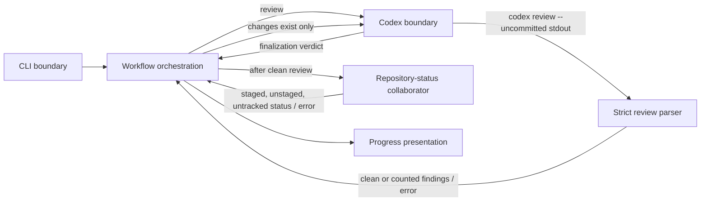

# FT-015: Design

## Design Pack

| Artifact | Role | Owns |
| --- | --- | --- |
| `design.md` | Feature-local solution and embedded C3 owner | `SOL-*`, `ALT-*`, `TRD-*`, `C4-*`, `SD-*`, `CTR-*`, `INV-*`, `FM-*`, `RB-*` |
| `decision-log.md` | Reasoning provenance | Source facts, alternatives, FPF closure and review cycles; no canonical solution facts |
| `../../../README.md` | Public CLI/output contract | Delivered review classification and terminal no-change event semantics |

## Context

`REQ-01`–`REQ-04` extend the Codex boundary without changing the review command. The new input is untrusted external process output, so the parser must be stricter than a best-effort JSON decode. The existing workflow remains owner of state transitions; it must decide whether a clean review can enter finalization only after deterministic repository-status evidence.

## C4 Applicability

`C4-03: C3 Component required and covered inline.` Existing components collaborate differently: the Codex boundary parses a second report representation and a repository-status collaborator informs the workflow's clean branch. No external system/deployable boundary changes, so C1/C2 add no useful information. Class-level C4 is not required; interfaces/types are implementation details.

## Architecture Coverage Decision

| Aspect | Decision | Coverage |
| --- | --- | --- |
| Components | covered | `internal/codex` owns invocation and strict review parsing; workflow owns state/exit decisions; a repository-status collaborator owns the Git query; `internal/runner` executes processes in the invocation directory. |
| Connectors | covered | Captured Codex stdout flows synchronously into the parser; a synchronous repository-status query returns either the three-category change result or an error; typed results drive workflow transitions. |
| Configuration | N/A | No option, environment or configuration-contract change is selected. |
| Behavioral semantics | covered | `CTR-01`–`CTR-03` define strict parser acceptance, unchanged plain-text fallback and the clean/no-change branch. |
| Quality / evolution | covered | Exact schema validation, duplicate-key rejection and fixtures keep the untrusted boundary fail-closed; the status collaborator is fakeable for deterministic tests. |

## Selected Solution

- `SOL-01` Attempt structured parsing only when the normalized report is a complete JSON object; otherwise retain the existing plain-text classifier unchanged.
- `SOL-02` Validate the observed Codex CLI 0.145.0 report shape exactly, reject duplicate keys at every nesting level and reject trailing data before classifying a result.
- `SOL-03` Map validated numeric `priority` values `0`–`3` to the existing critical/high/medium/low counters; a non-empty structured findings array is never clean.
- `SOL-04` After a clean result, query Git porcelain status for exactly staged, unstaged and untracked entries. Only an empty result skips finalization and completes with the existing successful run outcome.
- `SOL-05` Preserve the existing finalization branch whenever changes exist; status-query errors are operational failures.

### Structured Review Contract

- `CTR-01` A structured report is one JSON object with exactly `findings`, `overall_correctness`, `overall_explanation`, and `overall_confidence_score`. `findings` is an array; the three overall fields are string, string and JSON number respectively. No additional top-level field is accepted.
- `CTR-02` Each finding has exactly `title` (string), `body` (string), `confidence_score` (JSON number), `priority` (integer 0 through 3), and `code_location`. `code_location` has exactly `absolute_file_path` (string) and `line_range`; `line_range` has exactly integer `start` and `end`. Empty `findings` makes the report clean; otherwise each entry contributes one existing severity counter.
- `CTR-03` JSON that is malformed, has trailing data/duplicate keys, omits a required field, includes an unknown field, has an invalid required-field type or priority, or mixes a structured report with non-JSON output is unclassifiable and causes the existing operational-failure path. A valid non-JSON report is eligible only for the current plain-text classifier.
- `CTR-04` The repository-status query evaluates only staged, unstaged and untracked changes. Empty status after a clean review emits normal successful run completion and does not invoke finalization; non-empty status takes the unchanged finalization branch; an error follows operational failure.

### Accepted Decisions and Invariants

- `SD-01` The exact observed schema, not arbitrary JSON containing `findings`, is the supported structured format. A version is supported when it emits this contract; an incompatible future shape fails closed until a separately verified contract is added.
- `SD-02` Structured finding titles are preserved in the normalized review report for fix-findings; counters derive from numeric `priority`, not from a title prefix.
- `SD-03` No-change is a terminal success branch only after a successful classified clean review; it does not reinterpret review failures or reports with findings.
- `INV-01` Every successful classification is exactly one of clean or non-zero findings; neither class can coexist and every non-clean finding increments exactly one existing bucket.
- `INV-02` No malformed or semantically incomplete structured object can produce `Clean=true`, a counter, a fix prompt or finalization.
- `INV-03` Finalization can run only after a clean review and affirmative repository-status evidence of at least one staged, unstaged or untracked change.

### Failure Modes

| ID | Failure | Handling |
| --- | --- | --- |
| `FM-01` | Structured report is syntactically or semantically invalid | Emit failed review completion without counters; terminal operational failure. |
| `FM-02` | Structured report has findings but an unsupported priority | Reject the complete report; do not guess a severity. |
| `FM-03` | Git status cannot be queried | Emit diagnostic and terminal operational failure; do not claim no-op success. |
| `FM-04` | Clean report and empty Git status | Emit success without finalize-stage records or external publication side effects. |

### Rollout / Backout

- `RB-01` The change is a local binary behavior change with no persistent data or deployment topology. Reverting the release restores the prior strict plain-text-only behavior and has no data recovery step.

## Alternatives and Trade-offs

- `ALT-01` Accept any JSON object with `findings: []`. Rejected: an attacker/error could turn incomplete or unrelated data into a clean verdict, violating `CON-01`.
- `ALT-02` Ask `codex review` for a caller-supplied schema. Rejected: issue #15 concerns ordinary supported output and explicitly excludes changing the review command.
- `ALT-03` Let finalization decide whether to commit. Rejected: it still invokes external publication logic for an inapplicable no-change run and cannot prove `EC-04`.
- `TRD-01` Exact-schema support intentionally rejects compatible-looking future shapes until evidence validates them. This favors fail-closed safety over speculative forward compatibility.

## Risk-Based Design Verification

| Analysis | Required | Method | Result / evidence |
| --- | --- | --- | --- |
| Contract compatibility | yes | Fixture matrix for legacy plain text, valid structured clean/findings and rejected variants | `CHK-01`, `CHK-03` planned |
| State/transition completeness | yes | Workflow fake tests for clean-with-changes, clean-no-change and status error | `CHK-02`, `CHK-03` planned |
| Failure propagation | yes | Invalid report and Git-status-error fixtures confirm exit 2/no counters | `CHK-01`, `CHK-02` planned |
| Concurrency/ordering | no | No new asynchronous path or ordering mechanism is introduced. | N/A |
| Security boundaries | no | No auth/authorization boundary changes; existing external-process output boundary is covered by strict parsing. | N/A |
| Capacity/latency | no | One bounded local status command after a clean review adds no material capacity or latency concern. | N/A |
| Migration/evolution safety | yes | README/domain contract update and exact-schema version policy review | `CHK-04` planned |
