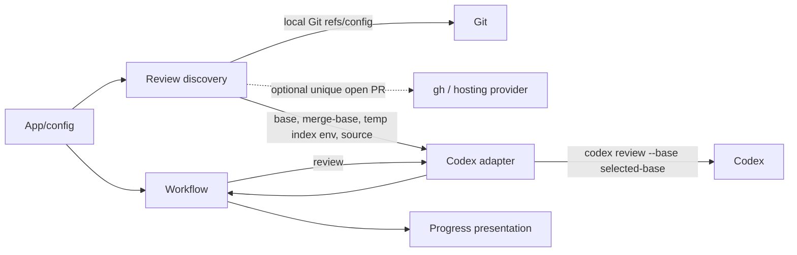

# FT-016: Design

## Design Pack

| Artifact | Role | Owns |
| --- | --- | --- |
| `design.md` | Feature-local solution owner | `SOL-*`, `C4-*`, `SD-*`, `CTR-*`, `INV-*`, `FM-*`, `RB-*` |
| `decision-log.md` | FPF provenance | facts, alternatives, gate and review-cycle history; no canonical solution fact |
| `../../../README.md` | Public CLI/output contract | shipped setting names, review behavior and event fields |

## Context

`REQ-01`–`REQ-07` extend only review input selection. The existing finalization status query remains responsible for deciding whether a clean review enters finalization. Git/provider output and the external Codex process are untrusted operational boundaries; no raw output may enter the event stream.

## C4 Applicability

`C4-03: C3 Component required and covered inline.` The CLI, configuration, workflow and Codex boundary remain in one process, but their collaboration changes: base discovery creates a temporary Git index and supplies review metadata to the Codex invocation. The optional `gh` query is an external connector, represented as an adapter within the repository boundary; no new deployable is introduced.

## Architecture Coverage Decision

| Aspect | Decision | Coverage |
| --- | --- | --- |
| Components | covered | `internal/config` resolves override; `internal/repository` resolves Git/provider facts and builds the disposable index; `internal/codex` invokes Codex with the selected target; workflow owns state/exit policy; event owns rendering. |
| Connectors | covered | Synchronous Git commands return typed candidate/error results; optional `gh` returns only PR base candidates; Codex inherits a scoped `GIT_INDEX_FILE` binding and returns captured stdout. |
| Configuration | covered | `review-base` uses the existing resolver and source reporting. No scope selector, credentials or provider setting is introduced. |
| Behavioral semantics | covered | `CTR-01`–`CTR-04`, `INV-01`–`INV-04` define precedence, complete snapshot, no mutation and failure paths. |
| Quality / evolution | covered | Temporary directories are removed; all external commands are fakeable; stable source tokens avoid free-form event values. |

## Selected Solution

- `SOL-01` Add `review-base` to the existing configuration resolver and CLI flags. Its value is a Git revision supplied by the existing configuration precedence; absence delegates to discovery.
- `SOL-02` Resolve a base once before the first review in this order: explicit configured revision; exactly one open PR base from optional `gh`; `branch.<current>.gh-merge-base`; exactly one resolvable remote default ref. Provider discovery obtains both branch name and base SHA, resolves that branch through exactly one remote-tracking ref (including slash-containing names), and fails if its locally resolved SHA differs from the provider SHA. Closed/merged PRs do not contribute. Provider-command unavailability is ignored only as an unavailable optional source; multiple candidates or any selected candidate that cannot resolve locally is an operational error.
- `SOL-03` Compute the merge-base of `HEAD` and the selected base. Copy the real index to a private temporary index, then populate it with `git add -A` under `GIT_INDEX_FILE`. Retaining the real index preserves `HEAD` content and sparse-checkout flags outside the sparse cone while the temporary add overlays staged, unstaged and untracked worktree changes. Invoke one `codex review --base <selected-base>` with that temporary-index environment without touching the real index/worktree.
- `SOL-04` Keep the temporary index for the complete review/fix loop and refresh its snapshot before every review, because fixes may change the worktree. Pin every Codex invocation to the resolved base SHA rather than the mutable symbolic ref; remove the temporary index at the end of the run. A clean result still uses the existing real-index repository-status query to decide finalization.
- `SOL-05` Emit only stable review metadata: `review_scope=branch_and_worktree`, `review_base=<resolved base SHA>`, `review_merge_base=<full SHA>` and `review_base_source=<stable source>`. Discovery failure is diagnosed on stderr and follows the existing operational-failure path before Codex.

## Interaction Contracts

- `CTR-01` Configuration exposes `--review-base`, `CODE_CONVERGE_REVIEW_BASE` and `.code-converge/review-base`; source precedence is unchanged. The built-in value is empty and means discovery, not a literal ref.
- `CTR-02` Discovery source is exactly `explicit`, `open_pr`, `branch_merge_base` or `remote_default`. Provider metadata contains `baseRefName` and `baseRefOid`; the branch name, including one containing `/`, resolves against exactly one remote-tracking ref before a same-named local branch can be used. Its resolved local SHA must equal `baseRefOid`, otherwise discovery fails with a fetch diagnostic. A detached HEAD, multiple PR candidates, multiple matching PR remote refs, multiple remote-default candidates, missing current branch, missing selected ref or missing merge-base is an error; no fetch occurs.
- `CTR-03` The temporary index is created outside the repository and is the only mutable Git index used to snapshot the review. The current real index is copied privately, then `git add -A` runs with `GIT_INDEX_FILE`; this preserves sparse-checkout entries and `HEAD` content outside the worktree while overlaying current changes. The real index, worktree, refs, remotes and hosting objects are not modified.
- `CTR-04` The Codex invocation receives `review --base <resolved-base-SHA>` and the temporary-index environment. The adapter refreshes the temporary index before every review and always removes it after the workflow. The existing report parser, fix prompt, finalization and real status behavior are unchanged.
- `CTR-05` Every review start/completion record carries the four review metadata fields. Values must satisfy existing key/value stream encoding; diagnostics and raw command output remain on stderr only.

## Accepted Decisions and Invariants

- `SD-01` `branch-and-worktree` is the direct default; no worktree-only compatibility mode or public scope selector exists.
- `SD-02` `--review-base` is an explicit revision override, not an instruction to fetch or to contact a provider.
- `SD-03` An already-merged branch has no committed delta but remains eligible to review staged, unstaged and untracked content; a fully clean result retains the existing no-change completion.
- `INV-01` Exactly one base source and one locally resolvable base commit are selected for a run, or review never starts; all reviews in that run use the same resolved base SHA.
- `INV-02` The snapshot is merge-base through current worktree state and contains each Git path exactly once, including committed paths outside a sparse checkout; ignored files remain excluded.
- `INV-03` No operation in discovery/snapshot may mutate the real index, worktree, refs, remotes or provider objects.
- `INV-04` A review refreshes its temporary snapshot after every successful fix attempt, so a later review cannot inspect a stale worktree.

## Failure Modes

| ID | Failure | Handling |
| --- | --- | --- |
| `FM-01` | Detached HEAD or no local/default candidate | Operational failure before Codex; actionable stderr diagnostic. |
| `FM-02` | More than one open PR, matching PR remote-tracking ref or remote default candidate | Operational failure before Codex; instruct user to set `--review-base`. |
| `FM-03` | `gh` missing/auth unavailable, incomplete PR base metadata or stale local PR base ref | Treat only unavailable provider discovery as unavailable; incomplete/stale metadata fails with a diagnostic, otherwise continue with local sources. |
| `FM-04` | Candidate/merge-base/temp-index command fails | Remove temporary material; operational failure; do not classify clean. |
| `FM-05` | Review/fix exits or context cancels | Remove temporary index; retain real repository state. |

## Rollout / Backout

- `RB-01` This is a local CLI/configuration change with no persistent data or deployment topology. Reverting the release restores `--uncommitted` behavior; temporary index files are process-scoped and cleaned on every exit path.

## Alternatives and Trade-offs

- `ALT-01` Use only `codex review --base`. Rejected: the issue explicitly says native base review alone must not accidentally omit untracked files.
- `ALT-02` Alter the real index with `git add -A`. Rejected by `CON-01`/`REQ-06`; copying it to a disposable index first preserves sparse-checkout semantics.
- `ALT-03` Generate a patch and ask a different Codex command to review it. Rejected: it changes the established review adapter/output boundary and has no evidence that report semantics remain equivalent.
- `TRD-01` A temporary index requires environment propagation through the runner, but confines Git mutation to disposable state and preserves one ordinary Codex review command.

## Risk-Based Design Verification

| Analysis | Required | Method | Result / evidence |
| --- | --- | --- | --- |
| Contract compatibility | yes | Configuration, event and fake-Codex invocation matrix | pass: `CHK-02`, `CHK-03`; concrete carriers are `EVID-02`, `EVID-03` in `brief.md` |
| State/transition completeness | yes | Workflow tests for discovery failure, clean/no-change and later review refresh | pass: `CHK-01`, `CHK-03`; concrete carriers are `EVID-01`, `EVID-03` in `brief.md` |
| Failure propagation | yes | Fake Git/`gh` failure and ambiguity matrix | pass: `CHK-01`; concrete carrier is `EVID-01` in `brief.md` |
| Concurrency/ordering | no | Workflow remains sequential; temporary index is private to one run. | N/A |
| Security boundaries | no | No auth policy changes; optional `gh` output is reduced to a base candidate and raw text stays diagnostic-only. | N/A |
| Capacity/latency | no | A bounded local Git preparation per review adds no network operation. | N/A |
| Migration/evolution safety | yes | README/domain/architecture convergence and no-fetch/no-mutation regression coverage | pass: `CHK-03`, `CHK-04`; concrete carriers are `EVID-03`, `EVID-04` in `brief.md` |
