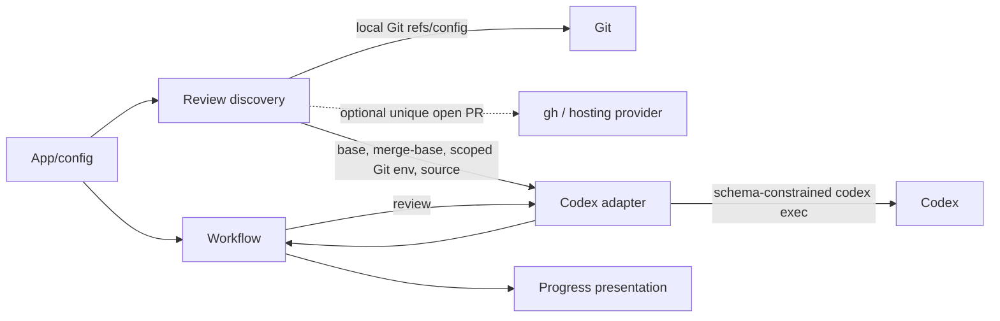

# FT-016: Design

## Design Pack

| Artifact | Role | Owns |
| --- | --- | --- |
| `design.md` | Feature-local solution owner | `SOL-*`, `C4-*`, `SD-*`, `CTR-*`, `INV-*`, `FM-*`, `RB-*` |
| `decision-log.md` | FPF provenance | facts, alternatives, gate and review-cycle history; no canonical solution fact |
| `../../../README.md` | Public CLI/output contract | shipped setting names, review behavior and event fields |

## Context

`REQ-01`–`REQ-07` extend only review input selection. The existing finalization status query remains responsible for deciding whether a clean review enters finalization. Git/provider output and the external Codex process are untrusted operational boundaries; no raw output may enter the event stream.

## C4 Applicability

`C4-03: C3 Component required and covered inline.` The CLI, configuration, workflow and Codex boundary remain in one process, but their collaboration changes: base discovery creates a temporary Git index and supplies review metadata to the Codex invocation. The optional `gh` query is an external connector, represented as an adapter within the repository boundary; no new deployable is introduced.

## Architecture Coverage Decision

| Aspect | Decision | Coverage |
| --- | --- | --- |
| Components | covered | `internal/config` resolves override; `internal/repository` resolves Git/provider facts and builds the disposable index; `internal/codex` invokes Codex with the selected target; workflow owns state/exit policy; event owns rendering. |
| Connectors | covered | Synchronous Git commands return typed candidate/error results; optional `gh` returns PR head identity and base candidates; Codex receives a wrapper-first `PATH` through a per-invocation shell-policy override with login-shell startup disabled, while the wrapper reads its private sidecar configuration and `GIT_INDEX_FILE` remains local to snapshot/helper execution. |
| Configuration | covered | `review-base` uses the existing resolver and source reporting. No scope selector, credentials or provider setting is introduced. |
| Behavioral semantics | covered | `CTR-01`–`CTR-04`, `INV-01`–`INV-04` define precedence, complete snapshot, no mutation and failure paths. |
| Quality / evolution | covered | Temporary directories are removed; all external commands are fakeable; stable source tokens avoid free-form event values. |

## Selected Solution

- `SOL-01` Add `review-base` to the existing configuration resolver and CLI flags. Its value is a Git revision supplied by the existing configuration precedence; absence delegates to discovery.
- `SOL-02` Resolve a base once before the first review in this order: explicit configured revision; exactly one open PR base from optional `gh`; `branch.<current>.gh-merge-base`; exactly one resolvable remote default ref. Provider discovery derives a host-aware identity, retaining IPv6 literal brackets and a non-default URL port, from every push URL of the configured push/provider remote. Only SCP-style SSH and `ssh`, `http`, or `https` URL transports identify a provider endpoint; `file`, `ftp`, and unknown URL schemes are non-provider destinations. Every URL must identify the same provider repository before it is authoritative; distinct valid identities fail, while an all-non-provider or mixed provider/non-provider URL set leaves provider discovery unavailable. Each `gh pr list` query sets a one-million candidate limit, causing `gh` to paginate instead of deciding uniqueness from its default first page of 30. It queries the verified head branch against the head repository and every configured same-host remote repository, then validates each returned PR head branch and repository identity before selecting a base. This permits a fork head to discover a PR owned by its upstream base repository and preserves that queried owner while resolving the base. When no normal push-remote setting exists, `origin` is the conventional fallback. Unverifiable or unrelated fork heads fail instead of contributing a candidate. A matching result is selectable only after every query target succeeds; a failed query remains an unavailable optional source only when no target returns a match. The base branch resolves through exactly one remote-tracking ref for the repository that owns the selected PR (including slash-containing names), and discovery fails if its locally resolved SHA differs from the provider SHA. Closed/merged PRs do not contribute. Multiple candidates or any selected candidate that cannot resolve locally is an operational error.
- `SOL-03` Compute the merge-base of `HEAD` and the selected base. Copy the real index to a private absolute temporary directory, clear `assume-unchanged` flags there, then populate it with `git add --sparse -A` under `GIT_INDEX_FILE`. This includes modified tracked files outside a sparse cone and hidden assume-unchanged entries without staging deletions for absent sparse paths; the real index remains unchanged. Invoke one schema-constrained `codex exec` with the selected base and merge base in its review instruction, a wrapper-prefixed `PATH` forced through `shell_environment_policy.set`, and `allow_login_shell=false`. This prevents login-shell initialization from prepending a system Git directory ahead of the wrapper. Do not export `GIT_INDEX_FILE` to Codex. The wrapper reads its private root, index and Git executable from an adjacent sidecar file, so `include_only` policies that admit `PATH` need not admit helper variables. The temporary `git` entry is a symlink to the running executable, so it remains usable from a noexec temporary mount. Its `PATH` directory contains only that wrapper; Git helpers are linked into a separate child-only `GIT_EXEC_PATH` directory, preventing direct `git-*` commands from bypassing review-index selection. Setup fails before a snapshot when either temporary path cannot be represented as one platform path-list entry. Its helper parses documented Git global options, including both `--namespace` forms, both `--attr-source` forms and `--list-cmds=<group>` probes; unknown or malformed global options fail closed. It applies the private index only after resolving the reviewed worktree. For every reviewed-root wrapper invocation it first creates a disposable command-local copy of the stable snapshot; `GIT_EXEC_PATH` is set only inside that Git child process to route aliases and hooks back through the wrapper. A descendant that bypasses the wrapper with an absolute Git executable can therefore affect only its command-local copy, never the stable review snapshot. Direct other-repository, repository-creating, and unclassifiable external-subcommand wrapper commands use their normal index. The overrides do not touch the real index/worktree.
- `SOL-04` Keep the temporary index for the complete review/fix loop and refresh its snapshot before every review, because fixes may change the worktree. Pin every Codex invocation to the resolved base SHA rather than the mutable symbolic ref; remove the temporary index at the end of the run. A clean result still uses the existing real-index repository-status query to decide finalization.
- `SOL-05` Emit only stable review metadata: `review_scope=branch_and_worktree`, `review_base=<resolved base SHA>`, `review_merge_base=<full SHA>` and `review_base_source=<stable source>`. Discovery failure is diagnosed on stderr and follows the existing operational-failure path before Codex.

## Interaction Contracts

- `CTR-01` Configuration exposes `--review-base`, `CODE_CONVERGE_REVIEW_BASE` and `.code-converge/review-base`; source precedence is unchanged. The built-in value is empty and means discovery, not a literal ref.
- `CTR-02` Discovery source is exactly `explicit`, `open_pr`, `branch_merge_base` or `remote_default`. Provider metadata contains `headRefName`, `headRepository.nameWithOwner`, `baseRefName` and `baseRefOid`. SCP-style SSH and `ssh`, `http`, or `https` URL transports are the complete provider URL allowlist; `file`, `ftp`, and unknown schemes never identify a provider. Every push URL for the selected remote must reduce to one identical host-aware identity, retaining IPv6 literal brackets and a non-default URL port; conflicting valid identities fail, while an all-non-provider or mixed provider/non-provider set makes provider discovery unavailable. `gh` queries the head branch against the selected identity and every configured same-host remote repository with a one-million result limit, so its normal 30-result page cannot establish a false unique result; the returned head name and repository must match the current branch and selected host/repository, with `origin` as the fallback only when normal push-remote settings are absent. A matching result is rejected if any query target is unavailable, because uniqueness is then unproven; an all-unavailable/no-match provider pass remains optional. The selected `gh --repo` target identifies which matching remote may supply the base branch: its name, including one containing `/`, resolves against exactly one remote-tracking ref before a same-named local branch can be used. Its resolved local SHA must equal `baseRefOid`, otherwise discovery fails with a fetch diagnostic. An unverifiable or mismatched PR head, detached HEAD, multiple PR candidates, multiple matching PR remote refs, multiple remote-default candidates, missing current branch, missing selected ref or missing merge-base is an error; no fetch occurs.
- `CTR-03` The temporary index is created in an absolute path outside the repository and is the only mutable Git index used to snapshot the review. The current real index is copied privately; its `assume-unchanged` entries are cleared only in that copy, then `git add --sparse -A` runs with `GIT_INDEX_FILE`. This overlays tracked edits outside a sparse cone, assume-unchanged changes and untracked content while preserving absent sparse paths and the real index, worktree, refs, remotes and hosting objects.
- `CTR-04` The Codex invocation uses `exec --output-schema <schema> --output-last-message <message> -`, receives the selected base and merge base in its review instruction, and receives a wrapper-prefixed `PATH` as a per-invocation `shell_environment_policy.set` value, with `allow_login_shell=false`. This prevents profile initialization from reordering `PATH` and making the review omit private-index-only content such as untracked files. That `PATH` directory exposes only the wrapper named `git`; a distinct, child-only `GIT_EXEC_PATH` directory carries Git's `git-*` helpers. Both temporary directories must be valid single platform path-list entries or setup fails before the snapshot. Codex never receives `GIT_INDEX_FILE`, `GIT_EXEC_PATH` or scoped-helper variables; the wrapper obtains them from its adjacent private sidecar and supplies `GIT_EXEC_PATH` only to its Git child process. Thus an `include_only` policy that allows `PATH` preserves the scoped transport without widening that allowlist, while Git aliases, hooks and helpers route descendant `git` commands back through the wrapper. Every reviewed-root wrapper command gets a disposable private-index copy, so an absolute Git path or command that bypasses `PATH` can inherit only a command-local index and cannot corrupt the stable review snapshot. The helper accepts Git's documented global option forms required for review commands, including `--attr-source=<tree-ish>`, `--attr-source <tree-ish>` and `--list-cmds=<group>`; unknown or malformed global options fail before Git receives an index. It then supplies the private index only when the resolved target is the reviewed repository. It clears the index for another repository, before `clone` or `worktree add` creates a repository, and for an external subcommand that is neither a built-in nor a safely classifiable alias. The adapter refreshes the temporary index before every review and always removes it after the workflow. Only the schema-valid final-message file is classified; terminal streams remain non-result data, while the fix prompt, finalization and real status behavior are unchanged.
- `CTR-05` Every review start/completion record carries the four review metadata fields. Values must satisfy existing key/value stream encoding; diagnostics and raw command output remain on stderr only.

## Accepted Decisions and Invariants

- `SD-01` `branch-and-worktree` is the direct default; no worktree-only compatibility mode or public scope selector exists.
- `SD-02` `--review-base` is an explicit revision override, not an instruction to fetch or to contact a provider.
- `SD-03` An already-merged branch has no committed delta but remains eligible to review staged, unstaged and untracked content; a fully clean result retains the existing no-change completion.
- `INV-01` Exactly one base source and one locally resolvable base commit are selected for a run, or review never starts; all reviews in that run use the same resolved base SHA.
- `INV-02` The snapshot is merge-base through current worktree state and contains each Git path exactly once, including committed paths outside a sparse checkout; ignored files remain excluded.
- `INV-03` No operation in discovery/snapshot may mutate the real index, worktree, refs, remotes or provider objects.
- `INV-04` A review refreshes its temporary snapshot after every successful fix attempt, so a later review cannot inspect a stale worktree.

## Failure Modes

| ID | Failure | Handling |
| --- | --- | --- |
| `FM-01` | Detached HEAD or no local/default candidate | Operational failure before Codex; actionable stderr diagnostic. |
| `FM-02` | Push URLs identify different provider repositories; PR head identity cannot be established or does not match the current branch provider; more than one matching open PR, PR-owner remote-tracking ref or remote default candidate | Operational failure before Codex; instruct user to set `--review-base`. |
| `FM-03` | `gh` missing/auth unavailable, incomplete PR base metadata or stale local PR base ref | Treat provider discovery as unavailable only when it yields no matching PR; a target-query failure after any match, incomplete metadata and stale local state fail with a diagnostic. |
| `FM-04` | Candidate/merge-base/temp-index command fails | Remove temporary material; operational failure; do not classify clean. |
| `FM-05` | Review/fix exits or context cancels | Remove temporary index; retain real repository state. |

## Rollout / Backout

- `RB-01` This is a local CLI/configuration change with no persistent data or deployment topology. Reverting the release restores `--uncommitted` behavior; temporary index files are process-scoped and cleaned on every exit path.

## Alternatives and Trade-offs

- `ALT-01` Use only `codex review --base`. Rejected: the issue explicitly says native base review alone must not accidentally omit untracked files.
- `ALT-02` Alter the real index with `git add -A`. Rejected by `CON-01`/`REQ-06`; copying it to a disposable index first preserves sparse-checkout semantics.
- `ALT-03` Generate a patch and ask Codex to review that separate artifact. Rejected: it creates a second review target and has no evidence that report semantics remain equivalent. The later FT-022 result-channel change uses `codex exec` against this same prepared private snapshot rather than generating a patch.
- `TRD-01` A temporary index requires scoped environment propagation through the runner, but confines Git mutation to disposable state and preserves one schema-constrained Codex review invocation.

## Risk-Based Design Verification

| Analysis | Required | Method | Result / evidence |
| --- | --- | --- | --- |
| Contract compatibility | yes | Configuration, event and fake-Codex invocation matrix | pass: `CHK-02`, `CHK-03`; concrete carriers are `EVID-02`, `EVID-03` in `brief.md` |
| State/transition completeness | yes | Workflow tests for discovery failure, clean/no-change and later review refresh | pass: `CHK-01`, `CHK-03`; concrete carriers are `EVID-01`, `EVID-03` in `brief.md` |
| Failure propagation | yes | Fake Git/`gh` failure and ambiguity matrix | pass: `CHK-01`; concrete carrier is `EVID-01` in `brief.md` |
| Concurrency/ordering | no | Workflow remains sequential; temporary index is private to one run. | N/A |
| Security boundaries | yes | Deterministic regression coverage proves the private index is injected without replacing the user's shell-environment allowlist, provider identity retains the host and non-default port, and every configured push destination agrees before `gh` is queried. | `CHK-01`, `CHK-02` |
| Capacity/latency | no | A bounded local Git preparation per review adds no network operation. | N/A |
| Migration/evolution safety | yes | README/domain/architecture convergence and no-fetch/no-mutation regression coverage | pass: `CHK-03`, `CHK-04`; concrete carriers are `EVID-03`, `EVID-04` in `brief.md` |
