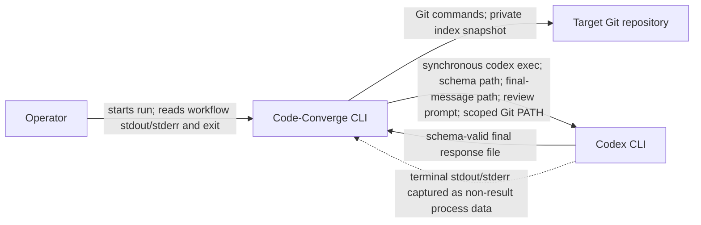

# FT-022: Design

## Design Pack

| Artifact | Role | Owns |
| --- | --- | --- |
| `design.md` | Feature-local solution owner | `SOL-*`, `ALT-*`, `TRD-*`, `C4-*`, architecture coverage, `SD-*`, `CTR-*`, `INV-*`, `FM-*`, `RB-*` and design verification |
| `decision-log.md` | Reasoning provenance | FPF source facts, alternatives, confidence, conflict resolution and human-gate state; no canonical solution facts |

The strict interaction contract remains compact in this document. No separate contract, sequence file or ADR is needed.

## Context

`REQ-01`–`REQ-05` replace a terminal-stream-dependent external process protocol. The existing `internal/repository.ReviewScope` still resolves and refreshes the review target, `internal/codex.Adapter` still interprets the agent result, `internal/runner` still owns subprocess mechanics, and `internal/workflow` still owns transitions and exit policy. Only the adapter-to-Codex connector and the authoritative review-result carrier change.

FT-015 remains the source baseline for the exact structured review object and fail-closed parser semantics. The root README and active architecture/PRD/testing documents currently describe the delivered pre-FT-022 `codex review` protocol; they remain current-state facts until implementation updates them atomically.

## C4 Applicability

| C4 ID | Decision | Trigger / reason | Artifact |
| --- | --- | --- | --- |
| `C4-01` | C1 System Context | The protocol between Code-Converge and the external local Codex CLI changes materially, including commands, channels and failure semantics. No deployable/container or internal responsibility boundary changes. | Embedded C1 view below |

### `C4-01` — Review integration context



## Architecture Coverage Decision

| Aspect | Status | Canonical owner / refs | Supporting view / artifact | Reason if N/A / coverage note |
| --- | --- | --- | --- | --- |
| Components / responsibilities | covered | `SOL-01`–`SOL-05`, `SD-03`; existing architecture owners | `C4-01` | Repository scope prepares the target; adapter prepares/interprets the protocol; runner executes/captures; workflow remains result/exit owner. |
| Connectors / interactions | covered | `CTR-01`–`CTR-05`, `SD-01`–`SD-04` | `C4-01` | One synchronous local process uses stdin, environment, two temp paths and captured terminal streams with an explicit sole result carrier. |
| Configuration / topology | covered | `SOL-01`, `SOL-02`, `SD-07`, `CTR-01`, `CTR-04` | `C4-01` | The process stays in the repository cwd with resolved model/effort; a wrapper-first `PATH` exposes the prepared snapshot only to Git commands targeting that repository without changing persistent config. |
| Behavioral semantics | covered | `SOL-03`–`SOL-05`, `CTR-03`–`CTR-05`, `INV-01`–`INV-06`, `FM-01`–`FM-09` | compact flow below | Ordering, target validation, result authority, fail-closed branches and unchanged workflow handoff are explicit. |
| Quality / evolution concerns | covered | `TRD-01`–`TRD-03`, `SD-05`, `FM-05`, `RB-01`–`RB-02` | design verification | Exact schema safety, capability-based compatibility, temp isolation, diagnostic separation and release backout are bounded. |

## Selected Solution

- `SOL-01` For each review, the adapter prepares a private `0700` temporary directory, writes the canonical review JSON Schema to a `0600` file and reserves a separate final-response path.
- `SOL-02` The adapter requires a configured `ReviewScope`, calls `ReviewScope.Prepare`, validates the selected base commit/computed merge base and wrapper-first `PATH`, and invokes `codex exec` with the resolved review model/effort, an invocation-local Codex shell-environment override for that `PATH`, login-shell startup disabled, the schema path, the final-response path and a stdin review instruction tied to the merge-base-to-private-snapshot comparison.
- `SOL-03` After a zero Codex exit, the adapter reads only the final-response file, applies the existing exact structured-review validation and preserves the normalized JSON as `ReviewResult.Report` for fix-findings.
- `SOL-04` Captured terminal stdout and stderr are never classification input and are never merged into the report. Runner error handling may use stderr to enrich a non-zero invocation diagnostic, preserving its existing diagnostic role.
- `SOL-05` The adapter returns the same `ReviewResult` categories and `ReviewTarget` metadata to the workflow, so workflow counters, transitions, events, budgets and exit meanings do not change.

## Review Invocation Flow

1. The adapter rejects a missing `ReviewScope`; otherwise `ReviewScope.Prepare` resolves or reuses the pinned base, refreshes the private index and returns `ReviewTarget`.
2. The adapter creates isolated schema/result paths and writes the strict schema.
3. The runner starts one synchronous `codex exec` in the existing repository cwd with the target environment and review instruction on stdin.
4. A non-zero process result returns immediately as an invocation failure; no final-response file is trusted.
5. After zero exit, the adapter reads and strictly validates only the final-response file.
6. A clean/findings `ReviewResult` with unchanged target metadata returns to workflow; every file/read/parse failure returns an error and follows the existing exit-2 path.
7. Temporary review-result files are removed best-effort when the adapter call returns.

## Alternatives Considered

| Alternative ID | Option | Why not selected |
| --- | --- | --- |
| `ALT-01` | Keep `codex review` and extend parsing across its terminal streams | It preserves the output-channel/prose dependency that caused issue #22 and would make stderr review data. |
| `ALT-02` | Merge stdout and stderr before the existing parser | It violates stream isolation, can mix progress with the result and cannot define one authoritative final response. |
| `ALT-03` | Consume the `codex exec --json` event stream | It expands the protocol to a complete JSONL event lifecycle when issue #22 requires only the schema-valid final message; ordering/version surface is larger. |
| `ALT-04` | Run `ParseReview` on the final-response file and retain plain-text fallback | Allowlisted prose in the file would be schema-invalid yet could classify as clean, violating `REQ-01`, `REQ-05` and `CON-01`. |
| `ALT-05` | Define an exact minimum Codex version and reject earlier versions before invocation | Available evidence proves the capabilities in 0.145.0 but does not prove which release introduced them. A fabricated version floor would not be evidence-backed. |
| `ALT-06` | Retain the `ReviewScope == nil` `codex review --uncommitted` branch | It creates a second terminal-stream protocol without the required pinned base/private-index target. Production wiring already provides `ReviewScope`; tests must exercise the production contract instead of preserving a test-only fallback. |

## Trade-offs

| Trade-off ID | Decision | Benefit | Cost / Risk |
| --- | --- | --- | --- |
| `TRD-01` | Require one exact nested schema and strict parser after schema generation | A clean result cannot arise from arbitrary prose or a partially compatible object | Future incompatible shapes fail closed until deliberately added. |
| `TRD-02` | Ignore successful-invocation terminal streams for classification | Stable result authority and no workflow stdout contamination | Successful progress/details are not available as result data; issue #14 separately owns durable diagnostics. |
| `TRD-03` | Use per-review temporary files | Matches Codex CLI capabilities and isolates concurrent local runs | Adds bounded local I/O and best-effort cleanup responsibility. |

## Accepted Local Decisions

- `SD-01` The sole authoritative result is the file named by `--output-last-message`; neither terminal stream is a fallback.
- `SD-02` The output schema is structurally identical to FT-015's accepted strict review contract. It adds no unsupported non-empty, confidence-range or line-order rules.
- `SD-03` The private review target is passed through unchanged: the same wrapper-first `ReviewTarget.Env` reaches Codex, and the instruction names the pinned selected-base commit, computed merge base and private snapshot semantics.
- `SD-04` A final-response file is considered only after a zero process exit; partial/stale output from a failed invocation is never classified.
- `SD-05` Codex compatibility is capability-based: versions supporting the required `exec` flags can participate; an unsupported invocation fails through the existing exit-2 operational path with no legacy fallback.
- `SD-06` A missing `ReviewScope` is an adapter configuration error. The adapter does not synthesize an unscoped review target or retain a legacy invocation branch.
- `SD-07` A wrapper-first `PATH` is supplied to the Codex process through `ReviewTarget.Env` and forced for Codex-spawned tool commands through invocation-local `shell_environment_policy.set.PATH`, with login-shell startup disabled. The wrapper reads the private index from its sidecar and injects it only after confirming that a Git command targets the reviewed repository; Codex never receives `GIT_INDEX_FILE`.
- `SD-08` The selected base commit is review provenance, while `ReviewTarget.MergeBase` is the comparison start. The instruction directs `git diff --cached <merge-base>` so FT-022 preserves the existing merge-base-to-worktree scope on diverged branches.

## Contracts

### `CTR-01` — Synchronous Codex invocation

With a non-nil `ReviewScope` that has successfully returned a `ReviewTarget`, the adapter invokes:

```text
codex <resolved model/effort args> -c shell_environment_policy.set.PATH=<TOML-quoted-wrapper-path> -c allow_login_shell=false exec --output-schema <schema-path> --output-last-message <message-path> -
```

The review instruction is supplied on stdin. The invocation uses the existing repository cwd through the runner and the exact `ReviewTarget.Env`, containing one non-empty wrapper-first `PATH`. The adapter quotes that path using the same TOML-safe value convention as model/effort overrides, forces it through Codex's invocation-local shell policy and disables login-shell startup. There is no adapter retry or new timeout; existing context cancellation/process-group behavior remains authoritative.

### `CTR-02` — Strict final-response schema

```json
{
  "type": "object",
  "additionalProperties": false,
  "required": [
    "findings",
    "overall_correctness",
    "overall_explanation",
    "overall_confidence_score"
  ],
  "properties": {
    "findings": {
      "type": "array",
      "items": {
        "type": "object",
        "additionalProperties": false,
        "required": [
          "title",
          "body",
          "confidence_score",
          "priority",
          "code_location"
        ],
        "properties": {
          "title": {"type": "string"},
          "body": {"type": "string"},
          "confidence_score": {"type": "number"},
          "priority": {"type": "integer", "enum": [0, 1, 2, 3]},
          "code_location": {
            "type": "object",
            "additionalProperties": false,
            "required": ["absolute_file_path", "line_range"],
            "properties": {
              "absolute_file_path": {"type": "string"},
              "line_range": {
                "type": "object",
                "additionalProperties": false,
                "required": ["start", "end"],
                "properties": {
                  "start": {"type": "integer"},
                  "end": {"type": "integer"}
                }
              }
            }
          }
        }
      }
    },
    "overall_correctness": {"type": "string"},
    "overall_explanation": {"type": "string"},
    "overall_confidence_score": {"type": "number"}
  }
}
```

The parser still rejects duplicate/case-variant keys and trailing data because JSON Schema generation does not itself prove the bytes read from disk are unique-key, exact-case or free of trailing content.

### `CTR-03` — Review instruction semantics

The instruction must:

- identify the pinned selected base commit from `ReviewTarget.BaseCommit` and the comparison start from `ReviewTarget.MergeBase`;
- tell the agent that scoped Git exposes the prepared private branch-and-worktree snapshot only for the reviewed repository;
- direct the agent to inspect the equivalent of `git diff --cached <ReviewTarget.MergeBase>`, not a direct diff from the selected base tip;
- request actionable code-review findings, with an empty array when none exist;
- require the final object defined by `CTR-02`;
- avoid changing the repository, real index, worktree, public workflow or finalization.

Exact prose is implementation-local provided these semantics and tests remain true.

### `CTR-04` — Channel ownership

| Channel / carrier | Owner and use | Classification rule |
| --- | --- | --- |
| stdin | Adapter → Codex review instruction | Input only |
| wrapper-first `PATH` | Repository scope → Codex process and spawned review tools through exact invocation-local override | Input only; exposes scoped Git without exporting `GIT_INDEX_FILE` or depending on user shell-environment filters |
| `--output-schema` file | Adapter → Codex response constraint | Input only |
| `--output-last-message` file | Codex → adapter review result | Sole classification/report carrier after zero exit |
| process stdout | Runner-captured Codex terminal output | Never review data; never copied to workflow stdout |
| process stderr | Runner-captured Codex diagnostics/progress | Never review data; may enrich non-zero runner error; never copied to workflow stdout |

### `CTR-05` — Failure mapping

| Failure | Adapter result | Workflow/public result |
| --- | --- | --- |
| Review scope is absent or prepared target lacks one required wrapper-PATH/base/merge-base value | Contextual configuration/target error before temp setup or Codex invocation | Existing failed review completion and exit `2` |
| Temp directory or schema write fails | Contextual setup error | Existing failed review completion and exit `2` |
| Codex exits non-zero | Runner error; ignore any message file | Existing failed review completion and exit `2` with diagnostic |
| Final-response file is missing/unreadable | Contextual read error | Existing failed review completion and exit `2` |
| File is empty, malformed, incomplete or schema-invalid | Strict parse/validation error | Existing failed review completion and exit `2` |
| File is valid with zero findings | `ReviewResult{Clean: true}` | Existing clean transition/counters |
| File is valid with findings | `ReviewResult` with existing counts/report | Existing fix-findings transition |

## Invariants

- `INV-01` Exactly one carrier can determine a review result: the final-response file after a zero invocation exit.
- `INV-02` A clean result requires a complete exact object with an empty `findings` array; prose and terminal streams cannot imply clean.
- `INV-03` Every accepted non-empty finding maps numeric priority `0`–`3` to exactly one existing counter and preserves its structured report for remediation.
- `INV-04` The review target returned to workflow, prompt, Codex process wrapper environment and invocation-local shell-environment override identify the same selected base, computed merge base and scoped private snapshot; comparison begins at the computed merge base.
- `INV-05` FT-022 changes no public workflow event field, severity meaning, budget or exit-code meaning.
- `INV-06` Every Codex review invocation follows the same prepared-scope structured protocol; no nil-scope terminal-parser fallback exists.

## Failure Modes

| Failure ID | Failure | Containment |
| --- | --- | --- |
| `FM-01` | Schema/result workspace cannot be created or schema cannot be written | Return a contextual adapter error before Codex starts. |
| `FM-02` | Codex rejects flags, fails, is cancelled or exits non-zero | Preserve runner diagnostic, ignore any result file and return operational failure. |
| `FM-03` | Codex exits zero but creates no readable final-response file | Report the missing/read failure; do not inspect terminal streams. |
| `FM-04` | Final response is empty, malformed, incomplete, has duplicate/case-variant/unknown keys, wrong types, invalid priority or trailing data | Strict validation fails; emit no counters and start no fix/finalize transition. |
| `FM-05` | Future Codex emits an incompatible result shape or lacks required capabilities | Fail closed with exit `2`; add support only through a separately evidenced contract change. |
| `FM-06` | Temporary cleanup fails after result/error construction | Cleanup remains best-effort and cannot change the review verdict; the `0700` directory limits exposure and no path becomes a public artifact. |
| `FM-07` | Adapter is called without `ReviewScope` | Return a contextual configuration error before temp setup or Codex invocation. |
| `FM-08` | Prepared target has no single non-empty wrapper-first `PATH` entry | Return a contextual target error before temp setup or Codex invocation; do not review a different index. |
| `FM-09` | Prepared target lacks a pinned selected-base commit or computed merge base | Return a contextual target error before temp setup or Codex invocation; do not infer a replacement comparison point. |

## Rollout / Backout

| Stage ID | Stage | Entry condition | Backout |
| --- | --- | --- | --- |
| `RB-01` | Pre-release validation and explicit approval | `AG-01`, all focused/full checks, channel-conflict matrix and independent review pass | Stop before publication; no external state or persistent migration exists. |
| `RB-02` | Local binary release | Required CI passes and README documents capability/failure semantics | Revert to the prior binary/release. This restores the old false-failure-prone protocol but cannot turn an invalid structured result into success or require data recovery. |

## Design Verification

| Analysis | Required | Reason / risk | Method | Result / evidence |
| --- | --- | --- | --- | --- |
| Contract compatibility | yes | Result shape and counter meanings must match FT-015 while the carrier changes | Field-by-field schema/parser comparison and public workflow inventory | `CTR-02`, `INV-03`, `INV-05`, `INV-06`; planned `CHK-01`, `CHK-03` |
| State / transition completeness | yes | Clean, findings, invalid target/output and invocation failure drive different workflow outcomes | Scenario/failure table walk-through | `CTR-05` covers every accepted result and `FM-01`–`FM-09` failure class; planned `CHK-03` |
| Failure propagation | yes | A wrong fallback or target binding could produce false clean, wrong-scope review or unreliable counters | Channel-conflict, target-policy, nil-scope and invalid-file analysis | `SD-01`, `SD-04`, `SD-06`–`SD-08`, `INV-01`–`INV-02`, `INV-04`, `INV-06`, `FM-01`–`FM-05`, `FM-07`–`FM-09`; planned `CHK-01`–`CHK-03` |
| Concurrency / ordering | yes | Multiple local runs must not share schema/result paths; file is trusted only after process completion | Per-call temp isolation and happens-before review | `SOL-01`, `TRD-03`, `SD-04`; unique temp paths and post-wait read are sufficient; planned adapter tests |
| Security boundaries | yes | External process, environment policy and temporary review content cross a local trust boundary | Channel/permission/threat review | `CTR-04`, `SOL-01`, `SD-07`, `FM-06`: exact wrapper-PATH override, repository-target validation, `0700` directory, `0600` schema, no private-index export, terminal-result merge or environment logging |
| Capacity / latency | no | One small schema write/read replaces terminal parsing and adds no load-sensitive path | N/A | No material capacity or latency decision. |
| Migration / evolution safety | yes | Older/incompatible Codex capabilities and current docs may diverge | Capability and current-state owner review | `SD-05`, `FM-05`, `RB-02`; planned `CHK-04`, `CHK-05` |

## ADR / External Design Dependencies

| Artifact | Current status | Used for | Rule |
| --- | --- | --- | --- |
| `../FT-015/design.md` | active / delivered | Exact structured result and strict validation baseline | Historical accepted contract is reused, not rewritten. |
| ADR | none | No reusable architectural choice is introduced | Re-route if implementation requires a cross-feature policy or component responsibility change. |

## Traceability

| Requirement ID | Solution refs | Contracts / invariants | Failure / rollout refs |
| --- | --- | --- | --- |
| `REQ-01` | `SOL-01`–`SOL-03`, `SD-02` | `CTR-01`, `CTR-02`, `INV-01`–`INV-03` | `FM-01`–`FM-05`, `RB-01` |
| `REQ-02` | `SOL-03`, `SOL-05`, `SD-02` | `CTR-02`, `CTR-05`, `INV-02`, `INV-03` | `FM-04`, `FM-05`, `RB-01` |
| `REQ-03` | `SOL-03`, `SOL-04`, `SD-01`, `SD-04` | `CTR-04`, `INV-01`, `INV-02` | `FM-02`–`FM-04`, `RB-01` |
| `REQ-04` | `SOL-02`, `SD-03`, `SD-06`–`SD-08`, `C4-01` | `CTR-01`, `CTR-03`, `CTR-04`, `INV-04`, `INV-06` | `FM-02`, `FM-07`–`FM-09`, `RB-01` |
| `REQ-05` | `SOL-01`–`SOL-04`, `SD-04`–`SD-08` | `CTR-05`, `INV-01`, `INV-02`, `INV-06` | `FM-01`–`FM-09`, `RB-01`, `RB-02` |
| `REQ-06` | `SOL-05`, `SD-01`, `SD-06` | `CTR-04`, `CTR-05`, `INV-03`–`INV-06` | `FM-02`–`FM-05`, `FM-07`, `RB-01`, `RB-02` |
| `REQ-07` | `SOL-01`–`SOL-05`, `SD-01`–`SD-08` | `CTR-01`–`CTR-05`, `INV-01`–`INV-06` | `FM-01`–`FM-09`, `RB-01` |
| `REQ-08` | `SOL-05`, `SD-05` | `INV-05` | `FM-05`, `RB-01`, `RB-02` |
