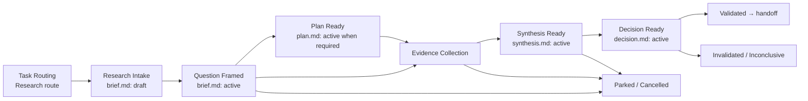

# Research And Discovery Flow

Research & Discovery Flow управляет задачей, чьим первым outcome является не delivery, а evidence-backed answer для named decision owner. **Discovery** — подходящее имя product-oriented режима этого flow, но не заменяет общий термин `research`: market research, technical spike и desk research могут не быть product discovery.

## Package Rules

1. Все документы одного исследования живут в `memory-bank/research/R-XXX/`.
2. `README.md` создаётся первым и владеет только package index. Текущий lifecycle state не дублируется в index: его единственный owner — `research_status` в `brief.md`.
3. `brief.md` — canonical owner decision question, mode, scope, assumptions, stopping condition и `research_status`.
4. `plan.md` — conditional owner method: sample/source strategy, collection protocol, timebox, bias/ethics/privacy controls. Не создавай его для очевидного, compact desk research, если method уже достаточно прозрачен в `brief.md`.
5. `evidence.md` — owner evidence log и provenance. Каждый material fact или observation обязан сослаться через `SRC-*` на clickable original-source link или stable access-controlled source record; raw sources могут жить в `sources/`, но должны быть linked и иметь контекст получения.
6. `synthesis.md` — owner findings, confidence, limitations, disconfirming evidence и remaining uncertainty.
7. `decision.md` — owner decision rationale, recommendation и promotion map. Terminal disposition записывается только как `research_status` в `brief.md`; этот документ не создаёт второго lifecycle state или active owner фактов, переданных downstream.
8. Используй templates из `memory-bank/flows/templates/research/`.

## Research Modes

| Mode | Typical question | Typical method | Usual handoff |
| --- | --- | --- | --- |
| `market` | Есть ли сегмент, спрос, positioning или конкурентный gap? | desk research, interviews, survey, analytics | product/marketing context, PRD, campaign initiative |
| `product_discovery` | Какая user problem/opportunity стоит delivery и какое направление может сработать? | interviews, journey analysis, prototype/usability test, experiment | PRD, Epic, Feature |
| `technical_discovery` | Feasible ли approach, integration или non-functional target; какой вариант предпочтителен? | code reading, spike, prototype, benchmark, vendor evaluation | ADR, Epic, Feature, Refactoring |
| `exploratory` | Что неизвестно и какое следующее решение оправдано? | bounded desk research or mixed methods | another research package, product context, no action |

Mode выбирает method и reviewers, но не меняет ownership или gates.

## Lifecycle

`research_status` belongs only to `brief.md`: `intake`, `framed`, `collecting`, `synthesizing`, `decision_ready`, `validated`, `invalidated`, `inconclusive`, `parked`, `cancelled` or `rerouted`.

## Transition Gates

### Bootstrap → Question Framed

- [ ] `README.md` и `brief.md` созданы по templates.
- [ ] `brief.md` имеет `status: active` и `research_status: framed`.
- [ ] записаны source/trigger, research mode, decision question и decision owner.
- [ ] scope/non-scope, working assumptions и stopping condition explicit.
- [ ] known evidence и material unknowns разделены; hypothesis не записана как fact.
- [ ] no delivery feature, implementation plan, accepted ADR or committed roadmap created solely from this research.

### Question Framed → Evidence Collection

- [ ] method proportionate uncertainty and risk; `plan.md` active when its trigger applies.
- [ ] sources/sample, collection window and evidence quality criteria are explicit.
- [ ] applicable privacy, consent, legal, security and vendor-access constraints are recorded.
- [ ] bias risks and at least one possible disconfirming signal are named.
- [ ] `brief.md` → `research_status: collecting`.

Create `plan.md` when research involves participants, a survey, prototype/experiment, benchmark, privileged/external data, non-trivial sampling, or a method choice that a reviewer could reasonably challenge.

### Evidence Collection → Synthesis Ready

- [ ] every material observation and factual claim in `evidence.md` has a linked `SRC-*`, source/provenance, date or freshness, collection context and quality note.
- [ ] evidence distinguishes observations, source claims and analyst interpretation.
- [ ] collection stopped by the stated condition or an explicitly recorded justified change.
- [ ] `synthesis.md` is `active`, includes findings, confidence, limitations and disconfirming/absent evidence.
- [ ] `brief.md` → `research_status: synthesizing`.

### Synthesis Ready → Decision Ready

- [ ] `decision.md` is `active` and names decision owner.
- [ ] recommendation answers the original decision question or explicitly says why it cannot.
- [ ] reasonable alternatives, confidence and residual uncertainty are visible.
- [ ] disposition is one of `validated`, `invalidated`, `inconclusive`, `parked`, `cancelled` or `rerouted`.
- [ ] a proposed delivery or architecture change is only a recommendation until its downstream owner is created and routed.
- [ ] `brief.md` → `research_status: decision_ready` before the owner decides, then to the matching disposition state.

## Outcome / Exit Contract

### Observable Outcome

The decision owner can make the named decision with traceable evidence, stated confidence and known limitations — or can explicitly decide that evidence is insufficient.

### Terminal Dispositions and Handoff

| Disposition | Meaning | Required handoff |
| --- | --- | --- |
| `validated` | Evidence sufficiently supports the hypothesis/direction. | Reroute any delivery to PRD, Epic, Feature, ADR or another owner; link the target from `decision.md`. |
| `invalidated` | Evidence sufficiently contradicts the hypothesis/direction. | Record rationale; optionally update product/marketing context. No delivery is implied. |
| `inconclusive` | Evidence cannot support a reliable decision. | Name the uncertainty, owner and next research question or stopping rationale. |
| `parked` | Work is intentionally deferred. | Name owner and review trigger/date. |
| `cancelled` | Work is stopped before a decision. | Record reason, evidence retained and consequences. |
| `rerouted` | The original question belongs in another existing flow. | Link target route and archive/close this package without duplicate ownership. |

When a durable fact is accepted, promote it before closing the research package: product/market facts go to their product owner; initiative intent to PRD or epic charter; delivery requirements to a feature brief; selected architecture to ADR or feature design. `decision.md` retains links and rationale, not a duplicate active fact.

## Boundary Rules

1. Research asks and answers a question; it does not silently commit implementation.
2. `brief.md` does not own findings, selected solution, delivery scope, implementation sequence or acceptance test contract.
3. `evidence.md` preserves provenance: every material fact links to `SRC-*`, and each `SRC-*` links to its original source or stable access-controlled record. It does not turn correlation, a source claim or a participant quote into a conclusion without synthesis.
4. `synthesis.md` may state confidence and recommendation inputs, but the decision owner records final terminal disposition only as `research_status` in `brief.md`; `decision.md` records its rationale and handoff.
5. Research evidence is not automatically representative, causal or current. Record sampling limits, freshness and material conflicts.
6. Do not copy private participant data, credentials, customer data or restricted source content into the repository. Store a minimal reference, access boundary and derived observation instead.
7. A technical spike may contain disposable code or benchmark commands, but production implementation requires a new routed delivery flow.
8. If findings change an active canonical fact, update that owner first; research artifacts remain derived evidence.

## Stable Identifiers

| Prefix | Meaning | Owner |
| --- | --- | --- |
| `RQ-*` | research question or sub-question | `brief.md` |
| `HYP-*` | falsifiable working hypothesis | `brief.md` |
| `RSC-*` / `RNS-*` | research scope / non-scope | `brief.md` |
| `ASM-*` | research assumption | `brief.md` |
| `STOP-*` | stopping condition | `brief.md` or `plan.md` |
| `SRC-*` | source or evidence item | `evidence.md` |
| `OBS-*` | observation grounded in source(s) | `evidence.md` |
| `FND-*` | synthesized finding | `synthesis.md` |
| `LIM-*` | limitation, bias or confidence constraint | `synthesis.md` |
| `REC-*` | recommendation | `decision.md` |
| `HD-*` | downstream handoff / promotion | `decision.md` |
